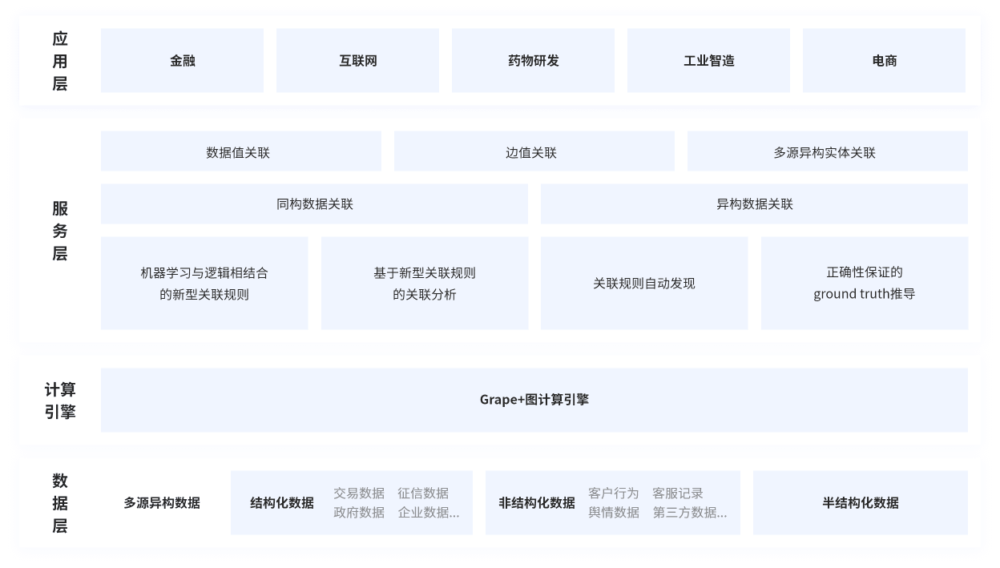

# 产品架构说明

产品架构

钓鱼城系统的产品架构逻辑上分为四层

- 应用层：为政企、金融、工业制造等行业人士提供国土安全、事件预测、反欺诈、风险管理、智能制造、精准营销等场景下的数据挖掘应用。可针对各行业数据特点进行定制，贴合行业需求，提高数据分析效率。
- 服务层：使用机器学习与逻辑结合的方式和基于新型关联规则的关联分析方式解决同构数据关联；使用关联规则自动发现的方式和正确新保证的ground truth推导方式解决异构数据关联。基于这两种数据关联，进行数据值关联、边值关联以及多源异构实体关联。
- 计算引擎：基于子图为中心不动点计算的理论基础实现Grape+图计算引擎，对构建的海量属性图做高效加载、图增量计算，实践证明该技术比传统图计算引擎如giraph++速度快10倍以上。
- 数据层：接入多源异构数据，如交易数据、征信数据、政府数据、企业数据等结构化数据，客户行为、客服记录、舆情数据、第三方数据等非结构化数据，以及介于二者之间，不通过固定数据模型描述数据关系的半结构化数据。对于后两种类型数据钓鱼城系统预置了成熟的机器学习模型将其自动转化为结构化数据，实现将多源异构数据灵活转化为图数据送入计算引擎进行处理。
