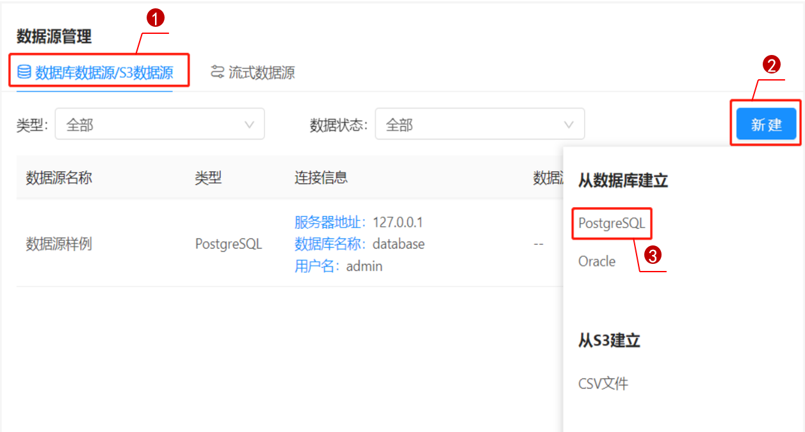
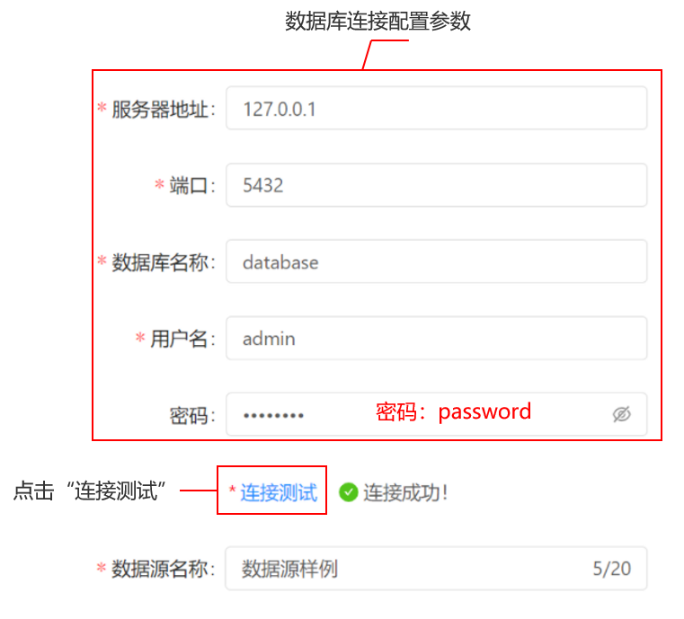
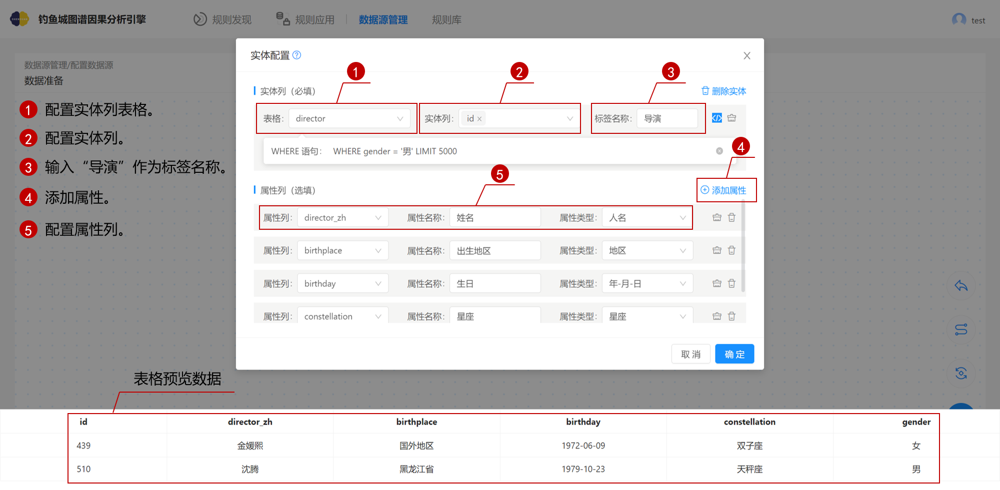
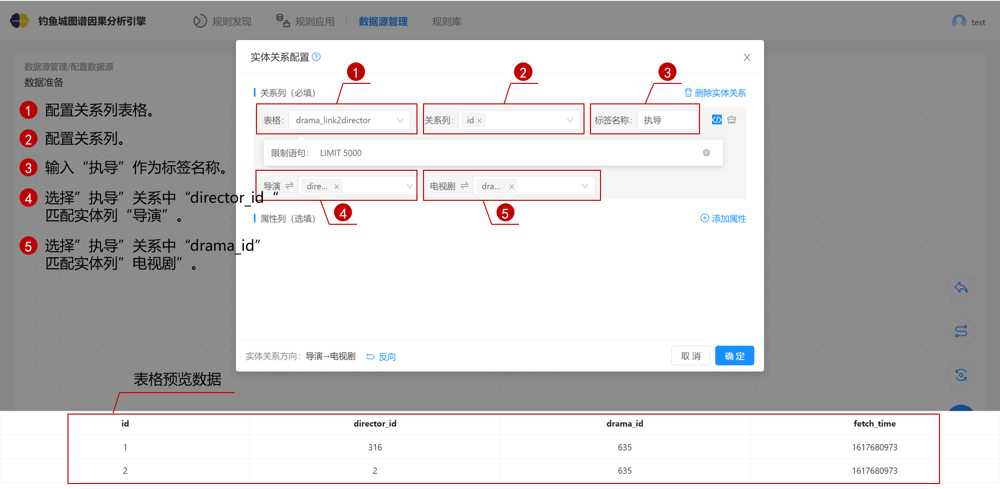
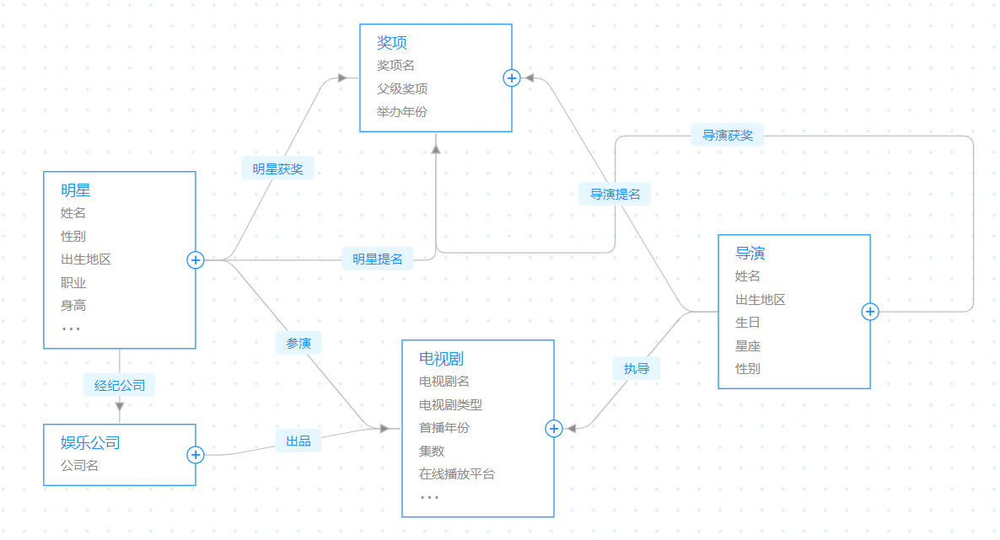

# 数据源管理

数据源管理包括连接数据库、数据准备、实体配置、实体关系配置、最终数据准备配置、检测结果。

#### 连接数据库

连接数据库为创建数据源的初始步骤，连接数据库流程只针对从数据库建立的数据源。

本文为您提供PostgreSQL数据源，供您练习并上手钓鱼城图谱因果分析引擎。数据库的连接信息如下表所示。

| 数据库连接信息 | 配置样例  |
| -------------- | --------- |
| 服务器地址     | 127.0.0.1 |
| 端口           | 5432      |
| 数据库名称     | database  |
| 用户名         | admin     |
| 密码           | password  |

PostgreSQL数据库的连接信息表

1. 在数据源管理界面依次点击`数据库数据源/S3数据源`、`新建`、`PostgreSQL`进入数据库连接界面。

   

连接数据库界面

2. 配置数据库连接数据，点击`连接测试`，显示“连接成功”的提示，如下图所示。

   

数据库连接配置参数

#### 数据准备

数据准备主要是提供关系数据转图数据所需的实体与实体关系，且对其做属性配置，以实现用图结构表达高维关系。

1. 点击界面中央的`添加实体`按钮，或者点击界面右下角的添加图标 ，添加实体，如下图所示。

   

2. 点击图标进入连线模式，如下图所示。

    

3. 连线模式中，点击左侧“实体”再点击右侧的“实体”后，左侧实体箭头指向右侧实体，箭头中有“待配置”字样为待配置的实体关系，如下图所示。

**说明：**实体关系具有方向性。添加实体关系需要先点击起点实体再点击终点实体。

#### 实体配置

本节以配置”导演“实体为例。

点击`实体待配置`，出现实体配置的弹窗吗，如下图所示。

1. 点击实体列中的“表格”选项，选择“director”表，实体配置弹窗下方显示表的两行预览数据。

2. 点击实体列中的“实体列”选项，出现表格列名的下拉框，选中表格，选择id列。

3. 输入“导演”作为标签名称。

4. 点击`添加属性`按钮，新增属性列。

5. 点击属性列右侧“请选择”窗口，出现表格列名的下拉框，选择`director_zh`。

6. 选择属性列后，属性名称自动填充为列名（director_z），属性类型自动填充（人名）；属性名称可以编辑修改，属性类型可以下拉选择。

实体配置

电视剧实体配置方法与导演实体配置方法一致。

#### 实体关系配置

点击红框中的`待配置`， 出现实体关系配置的弹窗，如下图所示。

1. 点击实体列中的“表格”选项，选择“drama_link2director”表，实体配置弹窗下方显示表的两行预览数据。

2. 点击关系列中的“关系列”选项，出现表格列名的下拉框，选中表格，选择id列。

3. 点击关系列的标签名，输入为“执导”。

4. 点击`导演`右侧中的`请选择`框，出现表格列名的下拉框，选中表格，选择director_id列。

5. 点击`电视剧`右侧中的`请选择`框，出现表格列名的下拉框，选中表格，选择drama_id列。

实体关系配置

#### 最终数据准备配置

实体、实体关系连线配置，如下图所示。

整体配置图

#### 检测结果

检测结果是系统依据图的点边数据、抽图过程的丢弃日志等来对图文件做出详细的评价。

数据准备环节中，实体与实体关系配置完成后，提交配置，出现抽图中的弹窗，抽图完成，如下图所示。

检测通过界面

