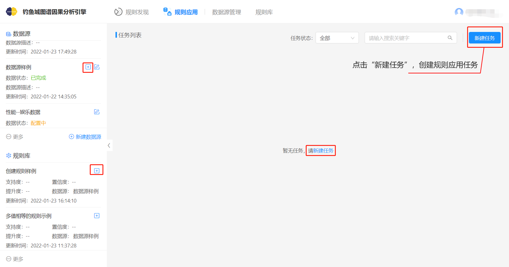
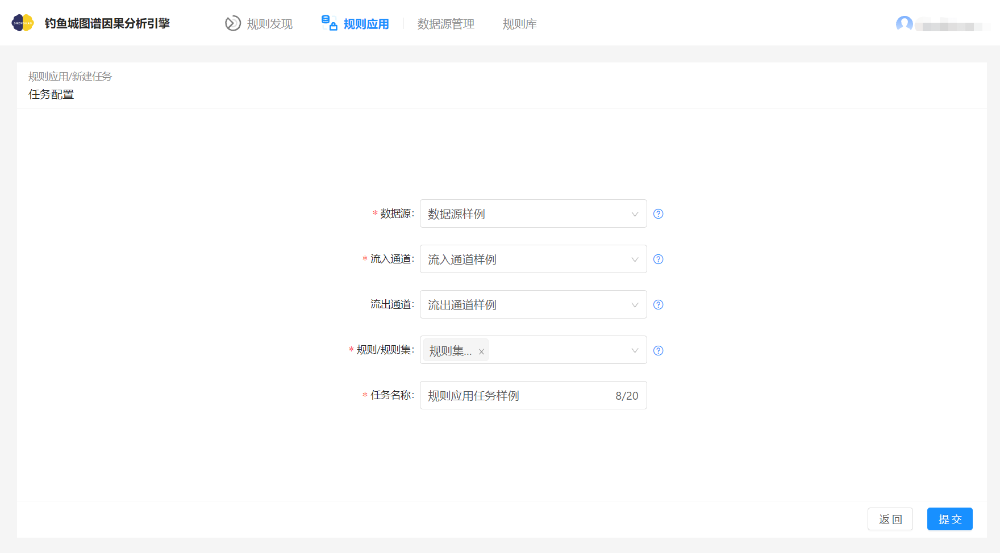
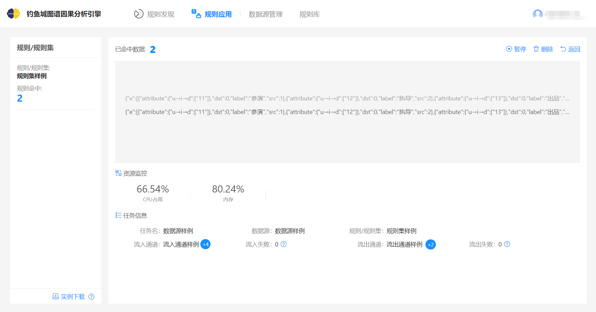
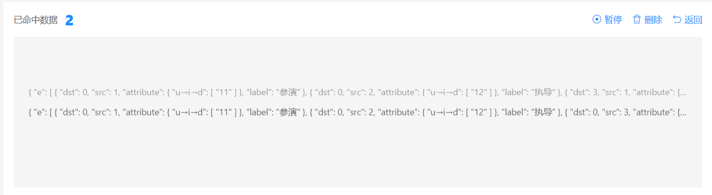
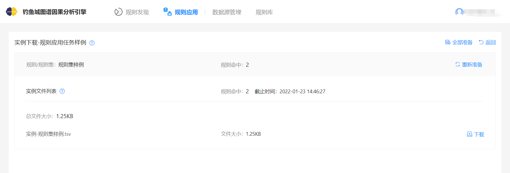
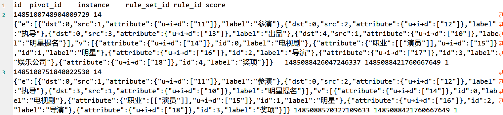

# 规则应用

利用已发现规则应对业务实时流式数据进行处理，对流式数据进行规则匹配，实时输出匹配结果用于风险控制、分类预测以及实时监控。

在完成以上准备工作之后，按照以下步骤进行规则发现和应用。

### 前置条件

须同时满足以下两个条件：

* 规则库中已存在状态为“正常”的规则/规则集。

* 数据源管理-流式数据源中已存在可用的Kafka通道。

### 新建任务

1. 根据业务需求创建相应规则应用任务。从任务列表右上角的新建任务按钮新建任务，将直接跳转到任务配置页面。

   

    

2. 在跳转到任务配置页面，完成如下图配置。

   

规则应用-任务配置

### 任务监控

任务创建完成后会自动跳转到任务监控页面。任务监控页面用于展示任务详情，包括该任务应用到的规则/规则集，已命中数据的滚动展示，资源消耗和任务的基本信息，同时可对命中的数据进行下载。

规则应用-任务监控

下图为新建任务时选择的规则/规则集，规则命中数为在流入数据中满足所选规则约束行为的起始实体的个数。

规则应用-任务监控-规则/规则集

下图为已命中的数据的滚动展示，左上角的`已命中数据`为所有规则/规则集的规则命中总和。

### 下载中心

有数据命中后可以点击左下角的`实例下载`按钮，将已命中的数据下载到本地进行查阅。

规则应用-下载中心

规则应用-下载中心

按钮说明

| 按钮名称 | 描述                                              |
| -------- | ------------------------------------------------- |
| 全部准备 | 点击该按钮后列表中所有规则/规则集进入下载准备中。 |
| 下载准备 | 点击该按钮后该规则/规则集进入下载准备中。         |
| 重新准备 | 下载准备完成后下载准备按钮变为重新准备按钮。      |
| 下载     | 点击该按钮后直接将该xxx.tsv文件下载到本地。       |
| 返回     | 点击该按钮后返回到任务监控页面。                  |

下载的文件打开后为如下形式

规则应用-下载的文件

表头说明:

| 表头名      | 描述                                                     |
| ----------- | -------------------------------------------------------- |
| id          | 标识该条数据的唯一id。                                   |
| pivot_id    | 轴点的id，即与规则中id为0的点匹配的instance中点的u→i→d。 |
| instance    | 与规则相匹配的一条子图数据。                             |
| rule_set_id | 下载时所选择的规则id。                                   |
| rule_id     | 下载时所选的规则id或规则集的id。                         |
| score       | 预留字段，暂无意义。                                     |

