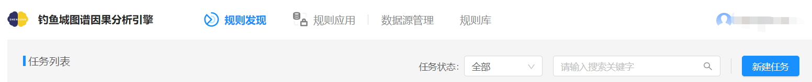
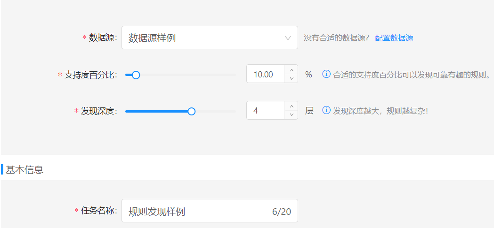
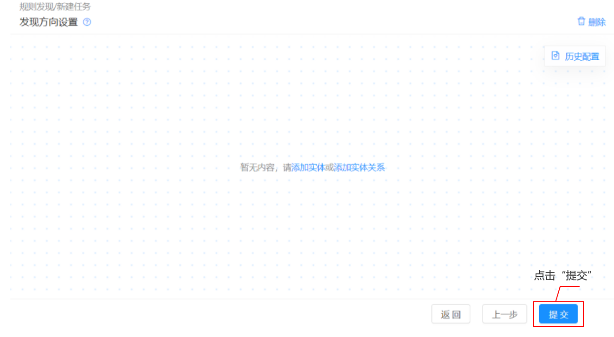
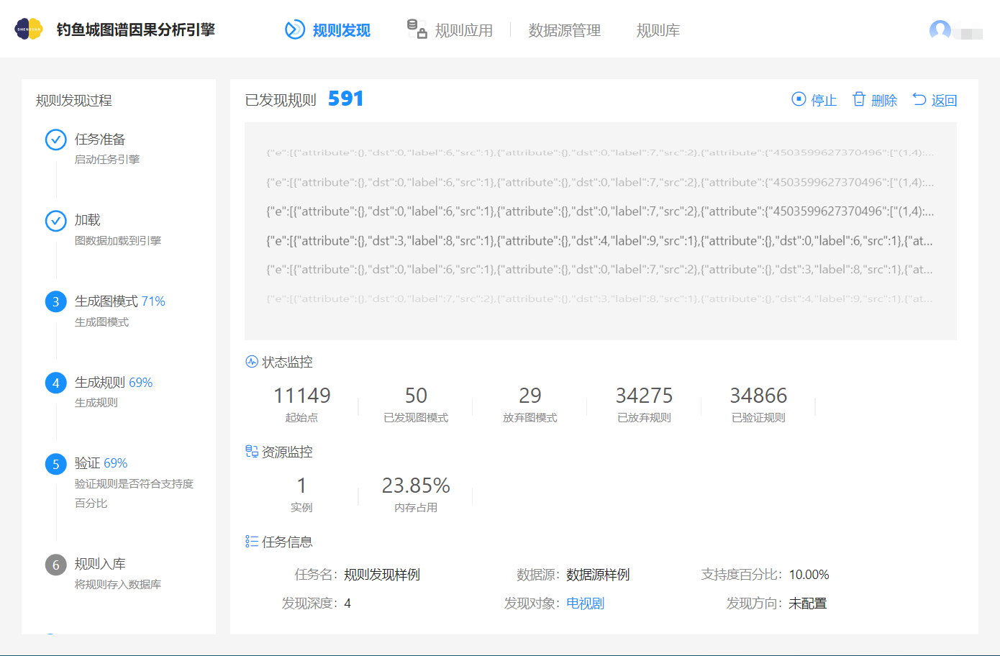
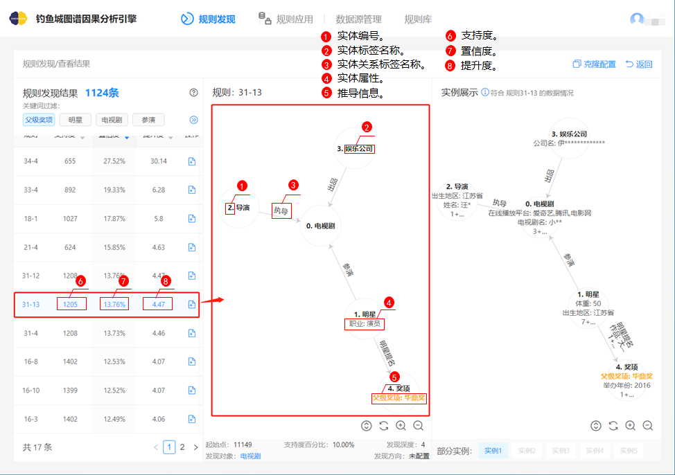
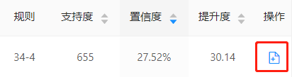
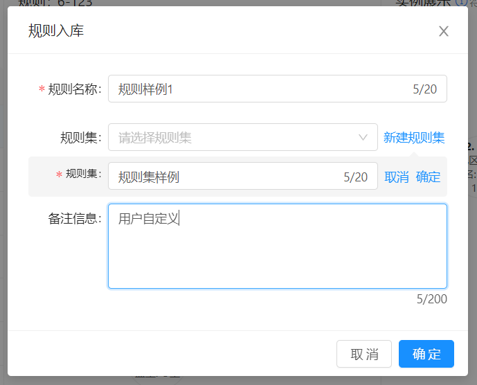

# 规则发现

该模块提供图数据分析能力和规则发现能力。用户通过指定数据源、支持度百分比、发现深度以及配置模式结构控制挖掘粒度。系统自动生成规则、计算规则的评价指标、获取实例并提供可视化界面，方便用户查看与操作。

**须满足如下条件：**

数据源管理中存在至少一个状态为已完成的数据库数据源/S3数据源。

#### **任务创建**

点击`规则发现`，进入规则发现模块，再点击`新建任务`，如下图所示。

规则发现-新建任务

#### 基础配置

按下图输入基础配置信息，完成配置后点击`下一步`。

规则发现-基础配置

#### 发现对象配置

1. 添加实体

   基础配置完成后，进入发现对象设置界面，点击`添加实体`，界面出现`实体待配置框`。

2. 实体配置

   点击`实体待配置`，标签选择`电视剧`，点击`确定`。

#### 发现方向配置

进入发现方向配置界面，不配置任何信息，点击`提交`。

规则发现-发现方向界面图

发现方向不配置任何数据，默认图模式中任意实体均可作为发现规则的推导信息。

#### 监控信息

提交任务后进入监控页面，任务完成后，5秒后界面自动跳转到规则发现结果界面。

规则发现-监控界面

#### 规则结果查看

任务完成后，界面自动跳转至规则发现结果界面。

规则发现-规则发现结果

### 规则入库

1. 点击`规则发现`，查看“规则发现样例”，进入规则发现结果界面，点击下图所示的入库操作图标。

   

   
规则发现-规则入库

2. 界面弹出弹窗，输入下图所示信息。新建规则集时，需点击规则集旁`确定`，否则规则集不会被创建。

   

规则发现-规则入库-信息配置

