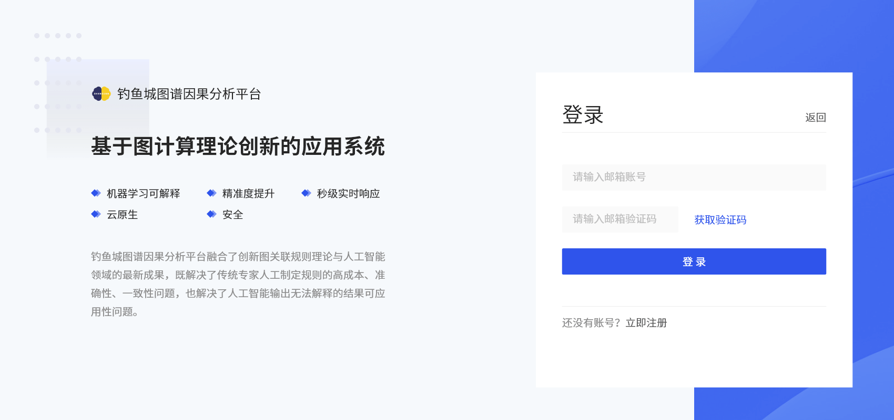
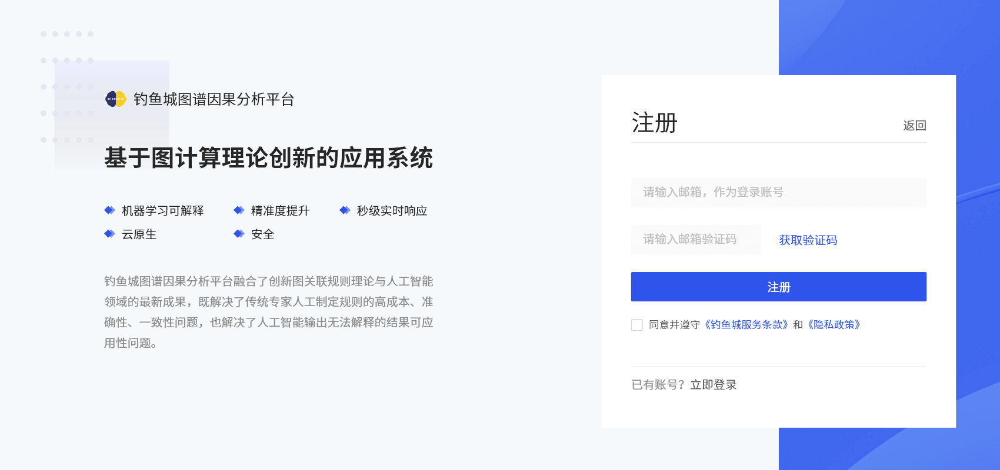
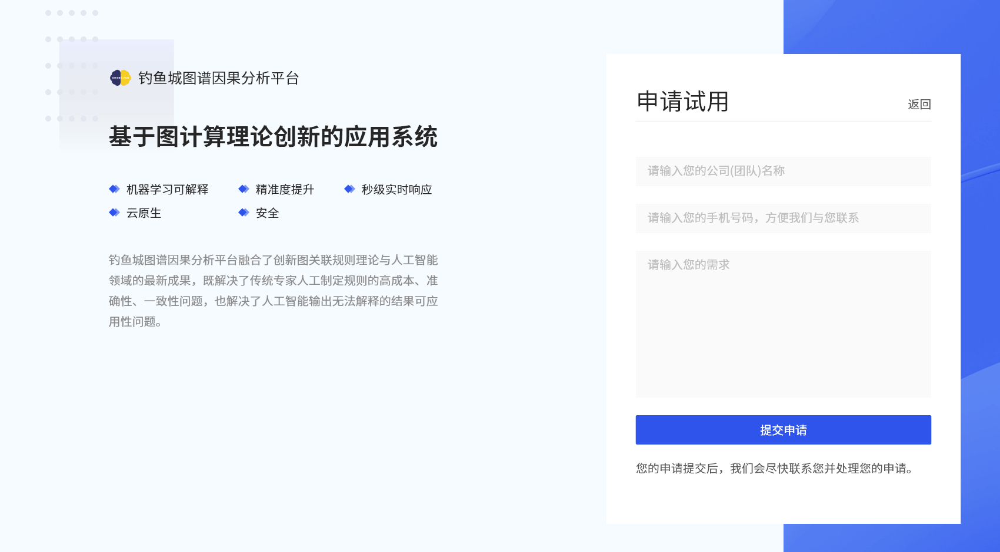

# **创建账号**

使用钓鱼城系统之前,您需要创建一个试用账号。

##### 1.找到登录入口

您可以在钓鱼城图谱因果分析平台官网顶部找到登录入口，点击登录进入登录页面。

##### 2.官网登录

在官网登录页面输入您的邮箱账号，获取验证码之后填入验证码输入框即可登录。（单个验证码有效时间为5分钟）

若您还没有官网账号，则您需要先创建一个官网账号。点击立即注册进入官网注册页面。

输入您的邮箱作为登录账号，获取验证码之后填入验证码输入框，阅读并同意《钓鱼城服务条款》和《隐私政策》之后即可注册官网账号。

##### 3.申请试用

登录之后,在官网顶部找到并点击申请试用，进入申请试用页面。

在申请试用页面提交您的公司（团队）名称、手机号及您的需求之后，即可提交申请试用。

##### 4.与您联系

在您提交试用申请的一个工作日内，我们的售前工程师将与您联系。为了及时与您联系，请保持联系畅通。

##### 5.试用账户创建成功

与您联系之后，如果您的试用申请通过，您将收到一个附有试用账户、密码及钓鱼城系统地址的邮件。请及时查收邮件。

