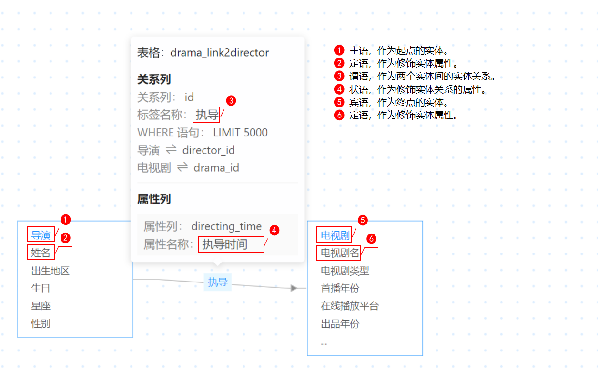

# 数据源管理

提供关系型数据转换为图数据的功能，支持对关系型数据转图数据结果检测，抽取的图数据为规则发现和规则应用建立基础。可实时查看数据转换过程信息，帮助用户管理不同数据源。支持对接多种关系型数据存储的库或方式：PostgreSQL、Oracle、S3；支持获取Kafka中的流式图数据，进行规则应用。

创建数据库数据源/S3数据源流程：

创建流式数据源流程：

### 数据源管理前置条件

数据管理分为`数据库数据源/S3数据源`和`流式数据源`的管理。

1. `数据库数据源/S3数据源`特指关系型数据库（目前支持PostgreSQL和Oracle）和存放在对象存储服务中的CSV文件，用户需要提供**公网可访问的数据库或对象存储服务**，并将待分析的关系型数据存放其中。
2. `流式数据源`特指存放在Kafka中的流式图数据，用户需要提供**公网可访问的Kafka服务**，并将待分析的数据按照指定的格式流入其中。

### 数据库数据源/S3数据源

#### 数据源种类

- PostgreSQL：连接PostgreSQL数据库，将存储在PostgreSQL的关系型数据转换为图数据。
- Oracle：连接Oracle数据库，将存储在Oracle的关系型数据转换为图数据。
- CSV文件-S3：将存放在对象存储服务器上的CSV文件载入系统并转换为图数据。

#### 连接数据库

连接数据库为创建数据源的初始步骤，连接数据库流程只针对`从数据库建立`的数据源。本节以创建PostgreSQL数据源为例。

1. 进入连接数据库界面，如图所示。

连接数据库界面

在数据源管理界面依次点击`数据库数据源/S3数据源`、`新建`、`PostgreSQL`进入数据库连接界面。

连接数据库界面的入口还有以下方式：

* 依次点击`规则发现`、`数据源`、`新建数据源`、`PostgreSQL`。

* 依次点击`规则应用`、`数据源`、`新建数据源`、`PostgreSQL`。

2. 数据库连接数据配置，如图所示。

数据库连接配置

数据库连接信息包括图中红框内容，详情信息如下表。
 

| 数据库连接信息 | 配置说明                                           | 配置样例  | 必要 |
| -------------- | -------------------------------------------------- | --------- | ---- |
| 服务器地址     | 访问数据库的IP地址。                               | 127.0.0.1 | 是   |
| 端口           | 访问数据库的端口。                                 | 5432      | 是   |
| 数据库名称     | 访问用于转换成图数据的关系型数据存放的数据库。     | database  | 是   |
| 用户名         | 对数据库名称配置的数据库有读权限的用户。           | admin     | 是   |
| 密码           | 上述用户名对应的密码，如若用户可无密码访问可不填。 | password  | 否   |

 

3. 点击“连接测试”，显示“连接成功”的提示，如图所示。

数据库连接成功

> 连接出现问题与建议如下：<!--格式待确定-->
> 问题：数据源连接失败，请重新配置数据库连接信息。
> 建议：查看除IP网段的所有数据库信息，是否有误。 
> 问题：请求超时。
> 建议：查看IP网段是否能正常访问。

#### 创建数据源

##### 创建数据库数据源
在数据库连接界面中，数据库连接成功后，填写数据源名称和数据源描述，如图所示。

数据源名称、描述配置

点击`下一步`，进入数据准备界面，同时数据源管理界面能看到新增的数据源，如图所示。

数据源管理界面

##### 创建S3数据源
创建S3数据源只需要将存放在对象存储服务器上的CSV文件载入系统。

系统只会拉取用户配置的Bucket下以.csv结尾的文件，目录和其它不满足条件的文件不会拉取，同时CSV文件还需满足以下条件：

* 文件名只能包含数字、中英文字符、下划线 "_" 和 连接号 "-"。

* 字符编码类型为UTF-8。

* 文件首行会作为表的字段名，故首行不能存在空字段。

1. 进入连接S3数据源配置界面，如图所示。

S3数据源配置入口

在数据源管理界面依次点击`数据库数据源/S3数据源`、`新建`、`CSV文件`进入数据库连接界面。
连接数据库界面的入口还有以下方式：

* 依次点击`规则发现`、`数据源`、`新建数据源`、`CSV文件`。

* 依次点击`规则应用`、`数据源`、`新建数据源`、`CSV文件`。

2. S3连接数据配置，如图所示。

  
S3数据源配置

S3连接详情信息如下表。

| S3连接            | 配置说明                                                | 配置样例                     | 必要 |
| ----------------- | ------------------------------------------------------- | ---------------------------- | ---- |
| Endpoint          | S3的地址信息。                                          | oss-cn-shenzhen.aliyuncs.com | 是   |
| Access key ID     | 访问密钥中的AccessKey ID。                              | accesskeyid                  | 是   |
| Secret access key | 访问密钥中的AccessKey Secret，相当于登录密码。          | secretaccesskey              | 是   |
| Bucket            | 相应的S3 Bucket信息，指存储空间，是用于存储对象的容器。 | bucket                       | 是   |

3. S3信息填写完成后，点击`下一步`，执行CSV文件导入操作，过程是先拉取后加载，显示`CSV文件拉取中`界面、`CSV文件加载中`界面。

4. 文件导入结果。

CSV文件导入结果如下：

- 所有CSV文件导入成功，成功进入数据准备界面。
- 部分CSV文件导入成功，结果如图“部分CSV文件导入成功界面”所示。点击`下一步`可以使用导入成功的CSV文件做数据准备。
- 所有CSV文件导入失败，出现相应弹窗，如图“所有CSV文件导入失败界面”所示。

部分CSV文件导入成功界面

所有CSV文件导入失败界面

其中，点击`重新配置`可以返回到连接S3界面；点击`查看详情`可以查看导入失败的CSV文件对应的错误日志，如图所示。

所有CSV文件导入失败详情界面

> 出现有异常的CSV文件能查看详情，两种异常：文件格式及编码错误、CSV内部格式错误。
> - 文件格式及编码错误：
>   * 读取文件列名失败，文件编码方式不为 UTF-8；
>   * 数据库外部表关联文件失败，文件首行表头异常。
> - CSV内部格式错误：
>   * 读取文件列名失败，文件可能为空；
>   * 数据库外部表关联文件失败，文件某行数据少于列数。

#### 数据准备

图数据作为一种语义网络拥有极强的表达能力和建模灵活性。数据准备主要是提供关系数据转图数据所需的实体与实体关系，且对其做属性配置，以实现用图结构表达原数据，便于挖掘数据中蕴含的高维关系。

##### 样例概述

抽图所需的实体为实际问题中客观存在的并且可以相互区别的事物，实体关系为实体之间的联系。

如图所示，导演通过执导关系指向电视剧，这个操作可以看做语句中的“主谓宾”结构。其中导演为主语，执导为谓语，电视剧为宾语。那么导演的属性值如姓名为修饰导演的定语，执导的属性值如执导时长为修饰执导的状语，电视剧的属性值如电视剧名为修饰电视剧的定语。

姓名叫张三的导演花了5年的时间执导了一部名字叫《李四传》的电视剧。其中：主语“导演”和宾语“电视剧”为两个实体，谓语“执导”为实体关系，其他信息分别为实体或者实体关系的属性。

数据准备

##### 添加实体

1. 添加实体的两种方式：

- 点击界面中央的`添加实体`按钮添加（数据准备界面无内容时，可通过此方式添加实体），如图所示。
- 点击界面右下角的添加图标添加，如图所示。

2. 添加后生成待配置的实体—`实体待配置`

实体添加

##### 添加实体关系

**连线模式添加实体关系**

1. 点击图标进入连线模式，如图所示。

进入连线模式

2. 连线模式中，点击左侧“实体”再点击右侧的“实体”后，左侧实体箭头指向右侧实体，箭头中有“待配置”字样为待配置的实体关系，如图所示。

左侧实体待配置

说明：实体关系具有方向性。添加实体关系需要先点击起点实体再点击终点实体。

3. 点击退出图标退出连线模式。

**直接添加实体关系**

点击实体图标右侧的。新增了实体并且原来的实体箭头指向新的实体，箭头中有“待配置”字样为待配置的实体关系，如图所示。

实体关系添加

说明：实体关系具有方向性。添加实体关系需要先点击起点实体再点击终点实体。

##### 自动布局

通过点击自动布局按钮，实现排版标准化。

##### 撤销操作

通过点击撤销按钮，实现返回上一步操作。

#### 实体配置

本节以配置”导演“实体为例，在数据准备界面上操作。

点击`实体待配置`，出现实体配置的弹窗如下图所示。

实体配置

**电视剧实体配置方法与导演实体配置方法一致**。

执行上图步骤配置实体。

1. 点击实体列中的“表格”选项，选择“director”表，实体配置弹窗下方显示表的两行预览数据。

2. 点击实体列中的“实体列”选项，出现表格列名的下拉框，选中表格，选择id列。

   * 实体列会被用来唯一标识实体，并与其它实体建立实体关系，因此该列的选择需要结合后续与该实体相连的实体关系配置中的[表格内容](#实体关系配置关联的实体列)来选择，即该表需要同样具备能唯一标识此实体的列，否则会导致实体关系抽取错误或失败。

   * 若某条数据的实体列有为空的情况，则该条数据将会被丢弃。数据为["", "无", "未知", "none", "nan", "null"]其中之一则认为是空数据。

3. 输入“导演”作为标签名称。

   > * 标签名称与其他实体/实体关系的标签名称不能相同。
   > * 标签名称限制在10个字符以内。

4. （可选）输入限制语句，对表格数据做限制，仅支持WHERE、LIMIT命令。

5. 点击`添加属性`按钮，新增属性列。

   * 属性列有为空的数据内容，则为空数据对应的属性会被丢弃。数据为["", "无", "未知", "none", "nan", "null"]其中之一则认为是空数据。
   * 属性类型为时间/数值且转换失败的属性会被丢弃。
     
     > 对于在数据库中是字符类型但属性类型被选为`时间`/`数值`的数据，系统会尝试将其转为数值类型，但会出现转换失败的情况，例如“180cm”因为其带有非数字的字符导致系统无法完成转换。对于此种情况，系统会将转换失败的属性丢弃。
   * 属性如果有相互冲突的属性值，只会保留其中一个属性值，其余丢弃。比如小明的年龄是20岁、30岁和40岁，那么图文件中只会保留其中一个年龄。

6. 点击属性列右侧“请选择”窗口，出现表格列名的下拉框，选择`director_zh` 。

7. 选择属性列后，属性名称自动填充为列名（director_z），属性类型自动填充（人名）；属性名称可以编辑修改，属性类型可以下拉选择。
   * 属性名称默认与属性列的名字一致，若出现名字字符超过10个，会出现“最多输入10个字符”的提示信息，并且会自动修正为10个字符。
   * 属性列不能重复，若出现重复情况，则出现属性列重复的提示。
   * 属性名称不能重复，若出现重复情况，则出现属性名称重复的提示。
   
   
   属性类型自动填充是系统根据当前列的数据内容，来判断属性类型。
   
   
属性类型描述的是图中实体或实体关系属性值所属的范畴或领域，例如”导演“的”姓名“的属性类型是”人名“，”导演“的”出生地“的属性类型是”地区“。更多的属性类型说明如下：

   
| 序号 | 中文名   | 英文名              | 说明                       |
| ---- | -------- | ------------------- | -------------------------- |
| 1    | 通用     | General             | 所有属性都可以配成该类型   |
| 2    | 成就     | Achievement         | 获奖奖项，荣誉称号等       |
| 3    | 地址     | Address             | 详细地址（街道乡镇及以下） |
| 4    | 文章标题 | Article Title       | 论文、期刊的标题，书名等   |
| 5    | 组织机构 | Organization        | 机关单位、组织团体名称等   |
| 6    | 血型     | Blood Type          | 常见血型                   |
| 7    | 公司名   | Company             | 公司名                     |
| 8    | 公司性质 | Company Type        | 公司性质                   |
| 9    | 星座     | Constellation       | 星座                       |
| 10   | 研究领域 | Research Field      | 研究领域                   |
| 11   | 教育程度 | Education Level     | 教育程度                   |
| 12   | 电子邮箱 | Email               | 电子邮箱                   |
| 13   | 性别     | Gender              | 性别                       |
| 14   | 商品描述 | Product Description | 电商平台中商品的标题       |
| 15   | 语言     | Language            | 语言                       |
| 16   | 月-日    | MM-DD               | 月日，例：1月1日           |
| 17   | 民族     | Nation              | 民族                       |
| 18   | 国家     | Country             | 国家                       |
| 19   | 职业     | Occupation          | 职业                       |
| 20   | 人名     | Person Name         | 人名                       |
| 21   | 地区     | Region              | 地区（区县及以上）         |
| 22   | 播放平台 | Platform            | 视频播放、上映平台         |
| 23   | 作品     | Production          | 音乐影视作品等的名称       |
| 24   | 作品类型 | Production Type     | 音乐影视作品的类型         |
| 25   | 宗教     | Religion            | 宗教                       |
| 26   | 学校名   | School              | 学校名                     |
| 27   | 学校类型 | School Type         | 学校类型                   |
| 28   | 特长     | Specialty           | 特长                       |
| 29   | 时间     | Time                | 时间戳                     |
| 30   | 年-月    | YYYY-MM             | 年月，例：2022年1月        |
| 31   | 年-月-日 | YYYY-MM-DD          | 年月日，例：2022年1月1日   |
| 32   | 生肖     | Zodiac              | 生肖，例：虎               |
| 33   | 数值     | Value               | 数值，例：58               |
| 34   | 商品品牌 | Brand               | 商品品牌                   |
| 35   | 商品类别 | Product Category    | 商品类别，例：家居百货     |

用户在选择属性列后，系统会根据属性列的值推理出3-5个可能的属性类型供用户选择。针对不同的属性类型，系统会采用不同的特征提取方式来从原始数据中获取更多维度的信息，从而发现更深层次的规则，因此用户需要选择一个最符合预期的属性类型，如果不确定究竟该选择哪一个，**通用**（**General**）是最稳妥的选择。

**实体配置说明**

1. 删除实体：点击`删除实体`，数据准备中的实体会被删除。
2. 清空配置：点击清空配置，实体配置中选择和填写的信息都会清空。
3. 删除属性列：点击删除属性列，该条属性列被删除。
4. 清空属性列：点击清空属性列，该条属性列选择和填写的信息都会清空。

#### 实体关系配置

点击两个实体间的`待配置`， 出现实体关系配置的弹窗，如下图所示。

> 实体关系配置的前提是被实体关系联系的实体需要事先配置好。

配置实体关系

执行上图步骤配置实体。

1. 点击实体列中的“表格”选项，选择“drama_link2director”表，实体配置弹窗下方显示表的两行预览
    数据。

2. 点击关系列中的“关系列”选项，出现表格列名的下拉框，选中表格，选择id列。

   * 关系列用于区分两个相同实体间的同标签的实体关系，例如明星“张三”多次获得“最佳男主角”奖项，就需要有多条获奖边来表示该关系，此时的关系列可选择`获奖时间`等能够区分这些边的字段。
   * 若实体列/关系列有数据内容为空，则该空数据对应的实体/实体关系将会被丢弃。
   * 若某条数据的关系列有为空的情况，则该条数据将会被丢弃。数据为["", "无", "未知", "none", "nan", "null"]其中之一则认为是空数据。
   * 如果实体关系所对应实体标签在已抽出的实体标签中不存在，则该条实体关系将被丢弃。

3. 点击关系列的标签名，输入为“执导”。

   * 标签名称与其他实体/实体关系的标签不能重名。
   * 标签名称限制在10个字符以内。

4. （可选）输入限制语句，对表格数据做限制，仅支持WHERE、LIMIT命令。

5. 点击`导演`右侧中的`请选择`框，出现表格列名的下拉框，选中表格，选择director_id列。

   * “导演”为实体关系的起点实体的标签名，“director_id“作为实体关系“执导”的外键（实体“导演”的主键—实体列）。
   * 若该实体有多个列作为实体列，则右侧选择框也拥有相同数量的列，且选择顺序相同。
   * 若实体关系对应的起点、终点实体的实体列为空，则该空数据对应的实体关系会被丢弃。数据为["", "无", "未知", "none", "nan", "null"]其中之一则认为是空数据。

6. 点击`电视剧`右侧中的`请选择`框，出现表格列名的下拉框，选中表格，选择drama_id列。

   * “电视剧”为实体关系的终点实体的标签名，“drama_id”作为实体关系“执导”的外键（实体“电视剧”的主键—实体列）。
   * 若该实体有多个列作为实体列，则右侧选择框也拥有相同数量的列，且选择顺序相同。
   * 若实体关系对应的起点、终点实体的实体列为空，则该空数据对应的实体关系会被丢弃。数据为["", "无", "未知", "none", "nan", "null"]其中之一则认为是空数据。

7. 点击`添加属性`按钮，新增属性列。

   * 属性列有为空的数据内容，则为空数据对应的属性会被丢弃。数据为["", "无", "未知", "none", "nan", "null"]其中之一则认为是空数据。

   * 属性类型为时间/数值且转换失败的属性会被丢弃。

     > 对于在数据库中是字符类型但属性类型被选为`时间`/`数值`的数据，系统会尝试将其转为数值类型，但会出现转换失败的情况，例如“180cm”因为其带有非数字的字符导致系统无法完成转换。对于此种情况，系统会将转换失败的属性丢弃。

   * 属性如果有相互冲突的属性值，只会保留其中一个属性值，其余丢弃。比如小明的年龄是20岁、30岁和40岁，那么图文件中只会保留其中一个年龄。

    > * 如果属性列有为空的数据内容，则为空数据对应的属性会被丢弃。
    > * 数据为["", "无", "未知", "none", "nan", "null"]其中之一则认为是空数据。
    > * 属性类型为时间/数值且转换失败的属性会被丢弃。
    > * 属性如果有相互冲突的属性值，只会保留其中一个属性值，其余丢弃。比如小明的年龄是20岁、30岁和40岁，那么图文件中只会保留其中一个年龄。

8. 点击属性列右侧`请选择`窗口，出现表格列名的下拉框，选择directing_time。

9. 选择属性列后，属性名称自动填充为列名（directing_），属性类型自动填充（数值）；属性名称
   可以编辑修改，属性类型可以下拉选择。

   * 属性名称默认与属性列的名字一致，若出现名字字符超过10个，会出现“最多输入10个字符”的提示信息，并且会自动修正为10个字符。
   
   * 属性列不能重复，若出现重复情况，则出现属性列重复的提示。
   
   * 属性名称不能重复，若出现重复情况，则出现属性名称重复的提示。
   
   属性类型自动填充是系统根据当前列的数据内容，来判断属性类型。
   属性类型修饰说明见[属性类型修饰说明](#实体属性类型修饰说明)。

**实体关系配置说明**

1. 其删除实体关系、清空配置、清空属性列、删除属性列与实体配置说明相似，见[实体配置说明](#实体配置说明)。
2. 实体关系配置最下方`反向`按钮，将起始点实体与终点实体互换，其在实体关系中对应的实体列不变。

#### 最终数据准备配置
实体、实体关系连线配置，如图所示。

整体配置图

#### 检测结果
检测结果是系统依据图的点边数据、抽图过程的丢弃日志等来对图文件做出详细的评价。

1. 数据准备环节中，实体与实体关系配置完成后，提交配置，出现抽图中的弹窗，如图所示。

   > 生成图文件过程中点击”返回数据源管理“，返回数据源管理界面，本抽图任务仍在后台运行。

抽图中界面

2. 抽图完成，如下图所示。

检测通过界面

3. 点击查看检测结果，出现检测结果的弹窗，如图所示。

检测结果

##### 编码检测
检测图文件编码是否正确。系统在抽图时会以编码/加密的方式对数据进行处理，解决用户数据的安全合规问题。此处是为了检验最终图文件是否按照预期完成编码/加密，并保证后续规则发现能够正常执行。

##### 属性类型检测
检测图文件属性数据是否符合类型，某一属性列表明为数值类型，则抽图文件中该属性列的属性值都必须为数值类型才能通过。
> * 若数值型列中的数据一大半填写数值一小半填字符，抽图过程中抽图异常—可修复，其属性类型检测会判定为失败。

##### 连通性检测

连通性列表5个连通分量分别的点边数量，其最大连通分量实体数为45014，总实体数为孤立点的个数加上连通分量点的个数，一共56033个。最大连通分量的实体数和总实体数的比例大于0.5，为通过，如图所示。
> * 检测图文件的连通性情况，实体/实体关系数量越集中，图文件质量越高，最大连通分量的实体数/总实体数>0.5即为检测通过。

连通性检测

##### 点边比例检测
检测图文件的点边比例，点边比例小于1即为检测通过。点边比例列表为各点（实体和实体关系）的数据量，点的总个数为：56,033, 边的总个数为：185,492，点边比为0.302，即点边比正常，如图所示。

点边比例检测

##### 信息熵检测

信息熵是信息论中用于度量信息量的一个概念。 一个系统越是有序，信息熵就越低； 反之，一个系统越是混乱，信息熵就越高。 所以，信息熵也可以说是系统有序化程度的一个度量。
信息熵过低，说明实体与实体关系的属性信息过于单一，可能回挖掘出大量意义不大的规则；
信息熵过高，说明实体与实体关系的属性信息过于随机，可能会导致包含该书信的规则因支持度不住而被抛弃；
公式计算如下所示：

##### 数值属性内容分布情况

显示数值内容的分布的箱型图，包含该属性列数值的上边缘、下边缘、上四分位数、下四分位数、中位数等
显示离群值。

显示标签和数值类型属性名，且显示箱型图和离群点，如图所示。

数值属性内容分布情况

##### 丢弃数据日志
不符合要求的数据将被丢弃，显示日志序号，丢弃数据原因和对应规则说明的编号。

规则说明：

1. 若实体列/关系列有数据内容为空，则该空数据对应的实体/实体关系将会被丢弃。

2. 若实体关系对应的起点、终点的实体列有数据内容为空，则该空数据对应的实体关系会被丢弃。

3. 如果实体关系所对应实体标签在已抽出的实体标签中不存在，则该条实体关系将被丢弃。

4. 如果属性列有为空的数据内容，则为空数据对应的属性会被丢弃。

5. 属性类型为时间/数值且转换失败的属性会被丢弃。

   > 对于在数据库中是字符类型但属性类型被选为`时间`/`数值`的数据，系统会尝试将其转为数值类型，但会出现转换失败的情况，例如“180cm”因为其带有非数字的字符导致系统无法完成转换。对于此种情况，系统会将转换失败的属性丢弃。

6. 属性如果有相互冲突的属性值，只会保留其中一个属性值，其余丢弃。比如小明的年龄是20岁、30岁和40岁，那么图文件中只会保留其中一个年龄。

   > 数据内容判断为空的标准：数据为["", "无", "未知", "none", "nan", "null"]其中之一则认为是空数据，如果是组合实体列/关系列，只要有一个实体列/关系列有数据内容为空也会丢弃对应的实体/实体关系。

### 流式数据源

对于需要做规则应用的新数据，需要通过Kafka通道以JSON格式传输进规则应用任务。

#### 创建流式数据源

填写相应的流式数据源信息，如图所示。

新增流式数据源

| 流式数据源 | 描述                 | 配置信息       | 是否必要 |
| ---------- | -------------------- | -------------- | -------- |
| Kafka地址  | 用户的Kafka地址。    | 127.0.0.1:9090 | 是       |
| Topics     | 用户的已有的Topics。 | data_flow_in   | 是       |
| 通道名称   | 流式数据源名称。     | 流入通道样例   | 否       |

