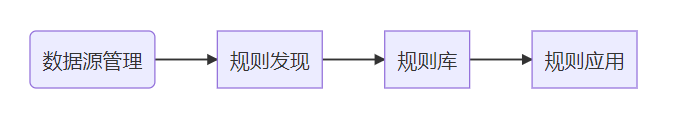

# 项目背景

什么样的电影票房会更高？下一届金鸡百花奖影帝影后会是谁？新生代演员中谁会大火？哪一家娱乐公司更有发展潜力？娱乐圈的发展很难预测，数据维度和影响因子过多导致了要在几万个明星，数千名导演，数万部电影以及数以万计的娱乐公司中做数据分析，无疑是耗时耗力的事情。娱乐公司的发展态势也很难以几个明星的发展或者参与作品的收视率票房量所预测。普通数据分析软件难以处理这样复杂而海量的数据，只能投入大量专家和时间分析。

钓鱼城系统把多个数据源（如PostgreSQL、Oracle、CSV-S3等）的数据转换成图数据。使用机器学习、特征工程等技术将明星的年龄、百科鲜花榜等数据抽象成年龄层、热度等更易于分析的数据。采用频繁子图挖掘，频繁项集挖掘，图分割，图压缩，增强图计算等图相关算法技术，分布式并行挖掘图数据中存在的关联规则。得到的规则可以使用规则应用功能对新输入的实时流式数据进行匹配，匹配结果可用于风险控制，分类预测，实时监控等领域。规则应用功能也可用于提升数据质量。

**项目流程**

