# 规则应用

利用已发现规则应对业务实时流式数据进行处理，对流式数据进行规则匹配，实时输出匹配结果用于风险控制、分类预测以及实时监控。

规则应用任务创建操作流程图如下：

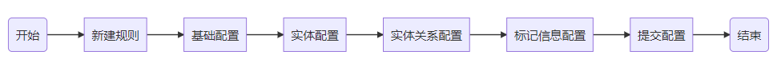


### 前置条件

须同时满足以下三个条件：

- 用户已登录。

* 规则库中已存在状态为“正常”的规则/规则集。

* 数据源管理-流式数据源中已存在可用的Kafka通道。


### 任务列表

用于展示已经创建的任务。

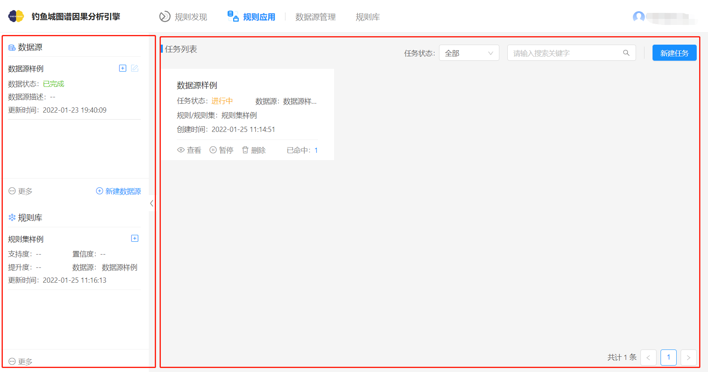

<center style="color:#C0C0C0">规则应用-任务列表界面</center>

如上图：

1.左侧为快捷操作`数据源`和`规则库`的侧边栏。

- `数据源`模块展示“数据源管理**-**数据库数据源/S3数据源”下的所有数据源。点击该模块的将跳转到数据源管理页面，点击将弹出选择新建数据源方式的侧边框，后续操作同“数据源源管理-数据库数据源/S3数据源”的新建。

  >1. 数据状态除“已完成”，其他状态的数据源均无按钮。
  >
  >2. 数据源状态为“已完成”但已用于状态为“进行中”的规则发现任务或规则应用任务，则该数据源的按钮不可点击。
  >
  >3. 若可点击，点击该按钮后有如下弹窗提示：
  >
  >   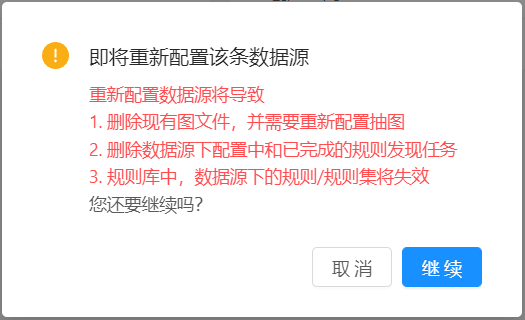
  >
  >   <center style="color:#C0C0C0">规则应用-配置数据源弹窗</center>
  >
  >

- 规则库模块展示规则库默认排序（更新时间降序排序）下的10条数据。点击该模块的将跳转到规则库页面。

2.右侧任务列表用于展示所有已经创建的任务。支持按任务状态进行过滤，支持通过关键字搜索任务。


### 新建任务

根据业务需求创建相应规则应用任务。

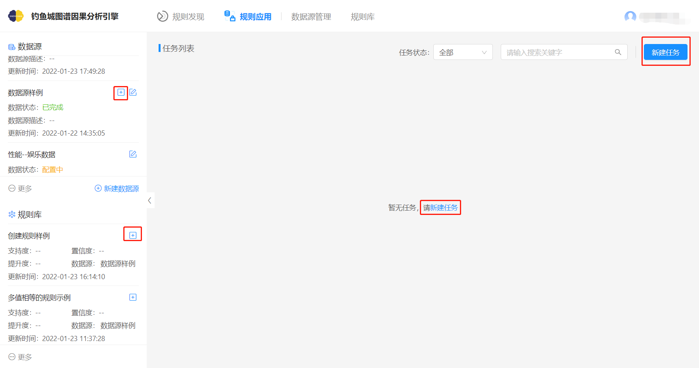

<center style="color:#C0C0C0">规则应用-任务列表</center>

如上图，新建任务有四种方式：

方式一：从左侧数据源按钮新建任务，将自动填充任务配置页面表单的数据源选择框为该数据源的名称。

方式二：从左侧规则库按钮新建任务，将自动填充任务配置页面表单的数据源选择框为该规则或规则集的数据源的名称，自动填充规则/规则集选择框为该规则/规则集名称。

方式三：任务列表无任务时，从提示的“新建任务”文字链接新建任务，将直接跳转到任务配置页面。

方式四：从任务列表右上角的新建任务按钮新建任务，将直接跳转到任务配置页面。

<br/>


本示例以方式四新建任务。

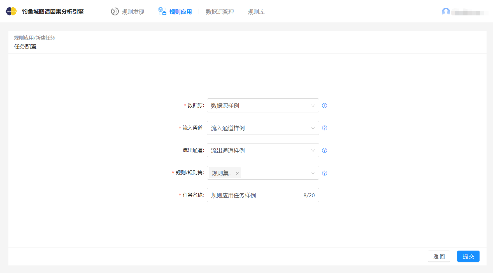
<center style="color:#C0C0C0">规则应用-任务配置</center>

<br/>

表单参数说明：

| <div style="width: 50pt">参数 </div> | <div style="width: 50pt">必选/必填</div> | 描述                                                         |
| ----------- | --------- | ------------------------------------------------------------ |
| 数据源      | 是        | 规则应用任务只能使用规则库中有正常状态规则/规则集的数据源。  |
| 流入通道    | 是        | 对于需要做规则应用的新数据，需要通过Kafka通道以JSON的形式传输进规则应用任务，用户可以在“数据源管理-流式数据源”中进行通道的管理。 |
| 流出通道    | 否        | 对于符合规则命中的实例数据，可以通过Kafka通道以JSON的形式传输出去，用户可以在“数据源管理-流式数据源”中进行通道的管理。 |
| 规则/规则集 | 是        | 规则/规则集需要与数据源对应，规则/规则集无法跨数据源使用。可以同时选择多个规则/规则集。 |
| 任务名称    | 是        | 选择数据源后默认为数据源名称，也可以根据需要修改，任务名称不得超过20个字符且前后不允许有空格，任务名允许重复。 |

<br/>

**注意事项：**

支持的规则约束：

- 只支持规则中的属性为常量的。如图：

<p align="center">
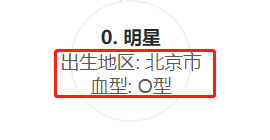
</p>

<center style="color:#C0C0C0">规则应用-规则中的属性为常量</center>

<br/>

- 不支持规则中的包含属性为变量的。如图：

  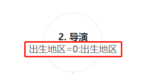

  <center style="color:#C0C0C0">规则应用-规则中的包含属性为变量的</center>

- 不支持规则中的包含属性为区间的。如图：

  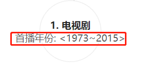

  <center style="color:#C0C0C0">规则应用-规则中的包含属性为区间的</center>

  


kafka通道流入数据有以下约束：

- 数据只能一条一条的流入。

- 流入数据必须为行为数据。

  如下图，明星—明星获奖→奖项，娱乐公司—出品→电视剧，诸如此类的数据为行为数据。

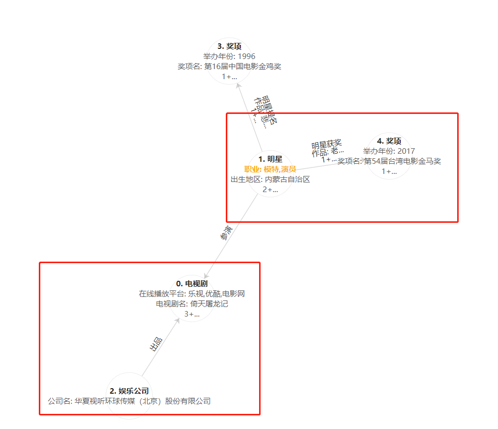
<center style="color:#C0C0C0">规则应用-行为数据图</center>


- 流入数据格式必须为JSON字符串，否则直接流入失败。

  以下为一个标准格式示例，里面所有字段是必需的，xxx根据实际值定。

  ```json
  {
  	"v": [
  		{
              "id": xxx,
  			"label": "xxx",
  			"attribute": {
  				"u→i→d": [
  					"xxx"
  				]
  			}
  		},
  		{
              "id": xxx,
  			"label": "xxx",
  			"attribute": {
  				"u→i→d": [
  					"xxx"
  				]
  			}
  		}
  	],
      "e": [
  		{
  			"dst": xxx,
  			"src": xxx,
  			"label": "xxx",
  			"attribute": {
  				"u→i→d": [
  					"xxx"
  				]
  			}
  		}
  	]
  }
  ```

  流入数据主要分为两部分：**实体（点）列表`v`**和**实体关系（边）列表`e`**

  - `v`应当包含两个实体，每个实体的字段说明如下。

  | id        | int    | 实体点在该条流入数据中的唯一编号，主要用来区分实体和构建实体关系。 |
  | --------- | ------ | ------------------------------------------------------------ |
  | 字段名    | 类型   | 说明                                                         |
  | label     | string | `数据库数据源/S3数据源`配置时所配置的实体标签。              |
  | attribute | dict   | 实体所携带属性的字典。                                       |

- `e`仅支持单个实体关系的流入，该实体关系的字段说明如下

  | 字段名    | 类 型  | 说明                                                |
  | --------- | ------ | --------------------------------------------------- |
  | src       | int    | 该实体关系的起点，与`v`中的`id`对应。               |
  | dst       | int    | 该实体关系的终点，与`v`中的`id`对应。               |
  | label     | string | `数据库数据源/S3数据源`配置时所配置的实体关系标签。 |
  | attribute | dict   | 实体关系所携带属性的字典。                          |

> 注：实体和实体关系的属性字典`attribute`中都需要带有`u→i→d`字段，用于在整个规则应用过程中唯一标识同一标签下的实体或实体关系。

明星—参演→电视剧示例：

```json
{
    "v": [
		{
            "id": 0,
			"label": "电视剧",
			"attribute": {
				"u→i→d": [
					"14"
				]
			}
		},
		{
            "id": 1,
			"label": "明星",
			"attribute": {
				"u→i→d": [
					"15"
				],
				"职业": [
					[
						"演员"
					]
				]
			}
		}
	],
	"e": [
		{
			"dst": 0,
			"src": 1,
            "label": "参演",
			"attribute": {
				"u→i→d": [
					"11"
				]
			}
		}
	]
}
```

> 注：该示例中"职业":[["演员"]]，“职业”为list类型，所以在此用["演员"]表示。

- 若配置了流出通道，流出通道流出的数据为JSON字符串，示例如下：

  ```json
  {
  	"score": 1.0,
  	"instance": {
  		"e": [
  			{
  				"attribute": {
  					"u→i→d": [
  						"11"
  					]
  				},
  				"dst": 0,
  				"label": "参演",
  				"src": 1
  			},
  			{
  				"attribute": {
  					"u→i→d": [
  						"12"
  					]
  				},
  				"dst": 0,
  				"label": "执导",
  				"src": 2
  			},
  			{
  				"attribute": {
  					"u→i→d": [
  						"13"
  					]
  				},
  				"dst": 0,
  				"label": "出品",
  				"src": 3
  			},
  			{
  				"attribute": {
  					"u→i→d": [
  						"10"
  					]
  				},
  				"dst": 4,
  				"label": "明星提名",
  				"src": 1
  			}
  		],
  		"v": [
  			{
  				"attribute": {
  					"u→i→d": [
  						"14"
  					]
  				},
  				"id": 0,
  				"label": "电视剧"
  			},
  			{
  				"attribute": {
  					"u→i→d": [
  						"15"
  					],
  					"职业": [
  						[
  							"演员"
  						]
  					]
  				},
  				"id": 1,
  				"label": "明星"
  			},
  			{
  				"attribute": {
  					"u→i→d": [
  						"16"
  					]
  				},
  				"id": 2,
  				"label": "导演"
  			},
  			{
  				"attribute": {
  					"u→i→d": [
  						"17"
  					]
  				},
  				"id": 3,
  				"label": "娱乐公司"
  			},
  			{
  				"attribute": {
  					"u→i→d": [
  						"18"
  					]
  				},
  				"id": 4,
  				"label": "奖项"
  			}
  		]
  	},
  	"pivotId": "14",
  	"ruleId": "1485088421760667649",
  	"ruleSetId": "1485088426047246337"
  }
  ```

  

所以对于下图这个规则，要想有数据命中该规则，至少流入4条行为数据。

> 注：流入数据只匹配规则中不包括黄色部分的内容

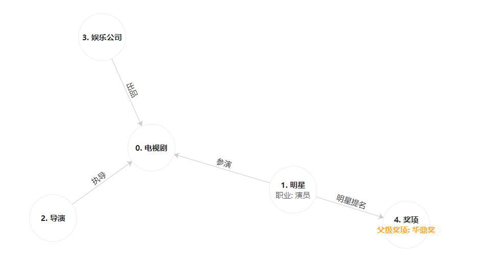

<center style="color:#C0C0C0">规则应用-规则示例</center>

流入4条数据，示例如下：

明星—参演→电视剧

```json
{
    "v": [
		{
			"attribute": {
				"u→i→d": [
					"14"
				]
			},
			"id": 0,
			"label": "电视剧"
		},
		{
			"attribute": {
				"u→i→d": [
					"15"
				],
				"职业": [
					[
						"演员"
					]
				]
			},
			"id": 1,
			"label": "明星"
		}
	],
	"e": [
		{
			"dst": 0,
			"src": 1,
			"attribute": {
				"u→i→d": [
					"11"
				]
			},
			"label": "参演"
		}
	]
}
```

导演—执导→电视剧

```json
{
	"v": [
		{
			"attribute": {
				"u→i→d": [
					"14"
				]
			},
			"id": 0,
			"label": "电视剧"
		},
		{
			"attribute": {
				"u→i→d": [
					"16"
				]
			},
			"id": 2,
			"label": "导演"
		}
	],
    "e": [
		{
			"dst": 0,
			"src": 2,
			"attribute": {
				"u→i→d": [
					"12"
				]
			},
			"label": "执导"
		}
	]
}
```

娱乐公司—出品→电视剧

```json
{
	"v": [
		{
			"attribute": {
				"u→i→d": [
					"14"
				]
			},
			"id": 0,
			"label": "电视剧"
		},
		{
			"attribute": {
				"u→i→d": [
					"17"
				]
			},
			"id": 3,
			"label": "娱乐公司"
		}
	],
	"e": [
		{
			"dst": 0,
			"src": 3,
			"attribute": {
				"u→i→d": [
					"13"
				]
			},
			"label": "出品"
		}
	]
}
```

明星—明星提名→奖项

```json
{
	"v": [
		{
			"attribute": {
				"u→i→d": [
					"15"
				],
				"职业": [
					[
						"演员"
					]
				]
			},
			"id": 1,
			"label": "明星"
		},
		{
			"attribute": {
				"u→i→d": [
					"18"
				]
			},
			"id": 4,
			"label": "奖项"
		}
	],
    "e": [
		{
			"dst": 4,
			"src": 1,
			"attribute": {
				"u→i→d": [
					"10"
				]
			},
			"label": "明星提名"
		}
	]
}
```


### 任务监控

任务创建完成后会自动跳转到任务监控页面。任务监控页面用于展示任务详情，包括该任务应用到的规则/规则集，已命中数据的滚动展示，资源消耗和任务的基本信息，同时可对命中的数据进行下载。

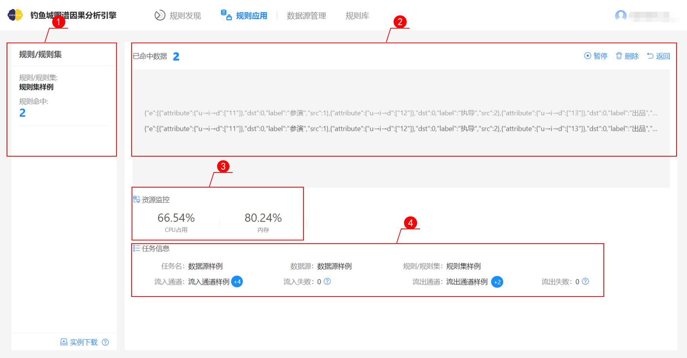

<center style="color:#C0C0C0">规则应用-任务监控</center>

①为新建任务时选择的规则/规则集，规则命中数为在流入数据中满足所选规则约束行为的起始实体的个数。

②为已命中的数据的滚动展示，左上角的`已命中数据`为所有规则/规则集的规则命中总和。

③为任务执行过程中资源分配和资源消耗的动态展示。所有的规则应用任务均以k8s（kubernetes的简写）pod的方式运行，内存和CPU占用为实时动态数据，每隔1秒会刷新一次。

④为任务的基本信息。各个字段说明如下：

| <div style="width: 50pt">字段名 </div> | 描述                                                         |
| -------------------------------------- | ------------------------------------------------------------ |
| 任务名                                 | 为新建任务时填写的任务名称。                                 |
| 数据源                                 | 为新建任务时选择的数据源名称。                               |
| 规则/规则集                            | 为新建任务时选择的规则/规则集。                              |
| 流入通道                               | 为新建任务时选择的流入通道名，当有数据流入时，流入通道名旁的气泡会实时显示流入的数据条数。单位K代表千（10^3），M代表兆（10 ^ 6)..... |
| 流入失败                               | 流入通道流入数据格式错误，导致流入数据编码失败。数据流入失败时该数值会+1。 |
| 流出通道                               | 若新建任务时未选择流出通道，则显示“未配置”，否则显示为新建任务时选择的流出通道名。当有数据流出时，流出通道名旁的气泡<br/>会实时显示流出的数据条数。单位K代表千（10^3），M代表兆（10 ^ 6)...... |
| 流出失败                               | 解码超时导致数据解码失败，数据流入失败时该数值会+1。         |


### 下载中心

有数据命中后可以点击左下角的`实例下载`按钮，将已命中的数据下载到本地进行查阅。

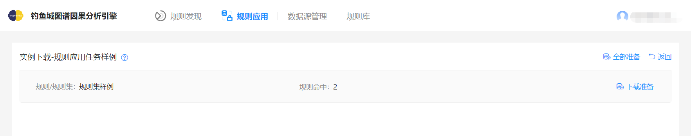
<center style="color:#C0C0C0">规则应用-下载中心</center>

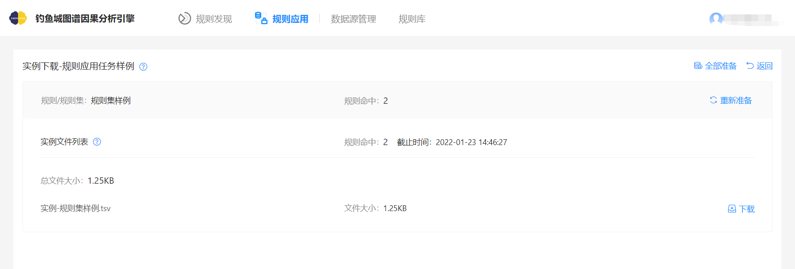
<center style="color:#C0C0C0">规则应用-下载中心</center>

按钮说明

| <div style="width: 80pt">按钮名称</div> | <div style="width: 150pt">描述</div>              |
| --------------------------------------- | ------------------------------------------------- |
| 全部准备                                | 点击该按钮后列表中所有规则/规则集进入下载准备中。 |
| 下载准备                                | 点击该按钮后该规则/规则集进入下载准备中。         |
| 重新准备                                | 下载准备完成后下载准备按钮变为重新准备按钮。      |
| 下载                                    | 点击该按钮后直接将该xxx.tsv文件下载到本地。       |
| 返回                                    | 点击该按钮后返回到任务监控页面。                  |


当下载的实例文件超过2G时，文件会被拆分成若干个小文件。

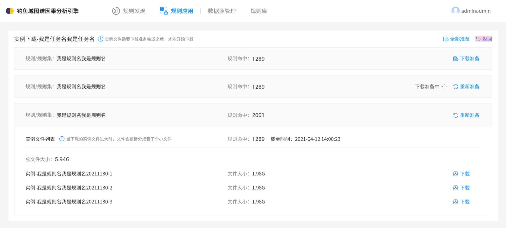
<center style="color:#C0C0C0">规则应用-下载中心-实例大小超2G</center>


下载的文件打开后为如下形式

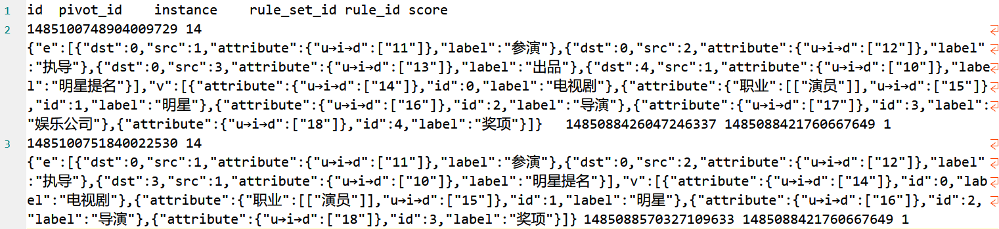
<center style="color:#C0C0C0">规则应用-下载的文件</center>

表头说明:

| 表头名      | <div style="width: 150pt">描述</div>                     |
| ----------- | -------------------------------------------------------- |
| id          | 标识该条数据的唯一id。                                   |
| pivot_id    | 轴点的id，即与规则中id为0的点匹配的instance中点的u→i→d。 |
| instance    | 与规则相匹配的一条子图数据。                             |
| rule_set_id | 下载时所选择的规则id。                                   |
| rule_id     | 下载时所选的规则id或规则集的id。                         |
| score       | 预留字段，暂无意义。                                     |
