# 规则库

 统一管理所有规则。包括规则发现任务发现的规则、新建的规则和编辑过的规则。用户可查看和编辑规则/规则集，使得规则库便于用户分类保存及后续查看规则。

### 前置条件

须满足如下条件：

- 用户已登录。
- 数据源管理中存在至少一个状态为已完成的数据库数据源/S3数据源。

### 规则库说明

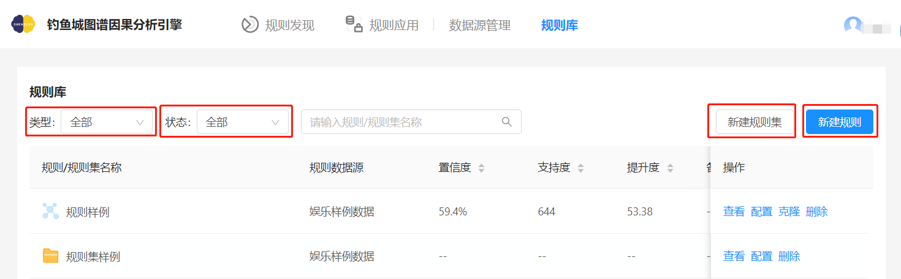

规则库-信息说明图

| 规则库操作 | 说明                                                         |
| ---------- | ------------------------------------------------------------ |
| 类型筛选   | 筛选规则库仅显示规则或仅显示规则集。                         |
| 状态筛选   | 根据规则/规则集状态筛选。若入库的规则对应的数据源被删除，则该规则就会被判定为失效规则。若数据源存在则规则正常。 |
| 新建规则集 | 规则集除规则发现结果界面可进行操作，也可直接在规则库中新建。 |
| 新建规则   | 用户可根据需求，自主创建规则。                               |

### 规则库查看

**查看规则库**

点击`规则库`，来到规则库界面，通过下图可以得知，添加的规则集以文件夹形式展示，而没有选择规则集的规则，直接在规则库中。

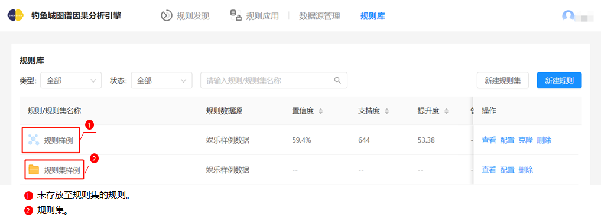

规则库-规则/规则集列表

**查看规则集**

点击规则集`规则集样例`时，界面展示所有添加至该规则集的规则。

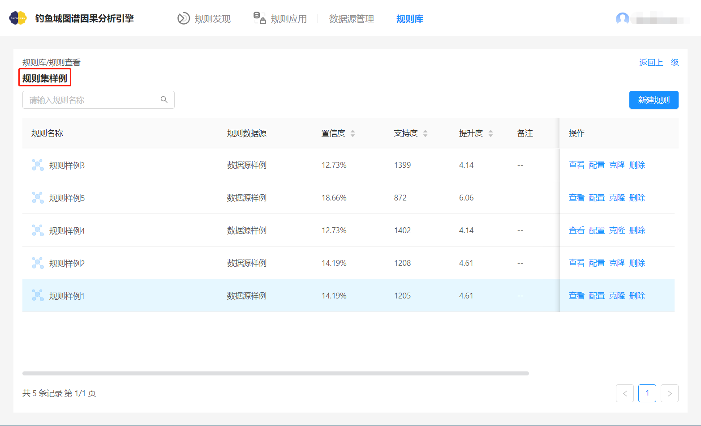

规则库-规则集

> 注：<!--格式-->
>
> - 同一规则集中仅能添加相同数据源的规则。

### 人工规则创建

为了查看人为的先验经验形成的规则在原始数据中的分布，用户也可自主创建规则，其创建具体步骤如下图所示。

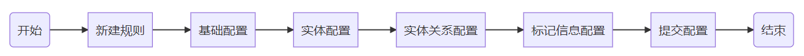

人工规则创建流程图

#### **基础信息配置**

点击`新建规则`，界面跳至规则创建界面，数据源选择`数据源样例`，规则名称输入`创建规则样例`。

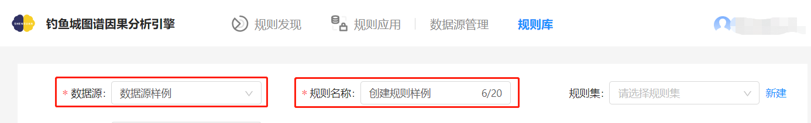

规则库-规则创建-基础配置

**配置说明**

| 信息项   | 说明                                                         |
| -------- | ------------------------------------------------------------ |
| 数据源   | 规则库中可以指定的任意状态为“已完成”的数据源。               |
| 规则名称 | 名称用户自定义，注意规则库内不论是入库规则、创建规则及规则集均不可重名，限定20字长。 |
| 规则集   | 可选择相同数据源的规则集，也可自主创建新的规则集，也可不选择规则集。 |
| 备注     | 用户自定义信息，限定200字长。                                |

#### **实体配置**

1. 点击`添加实体`，在实体配置中，标签选择`明星`。属性选择`职业`，属性值选择`演员`，完成第一个实体配置。

   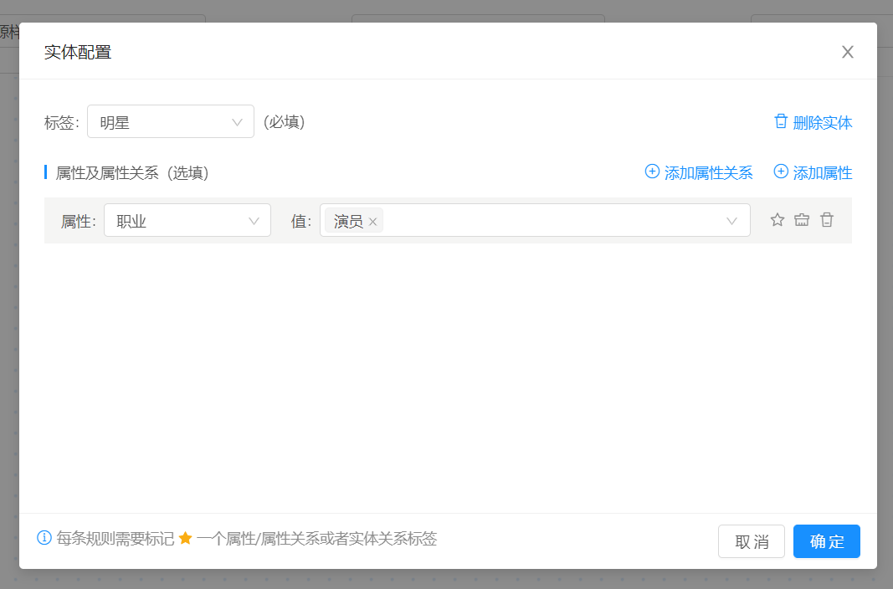

规则库-规则创建-实体配置

2. 点击`明星`实体框后的加号，如下图所示。在与其相连的实体配置中，标签选择`电视剧`，属性选择`电视剧类型`，属性值选择`剧情`，完成第二个实体配置。

   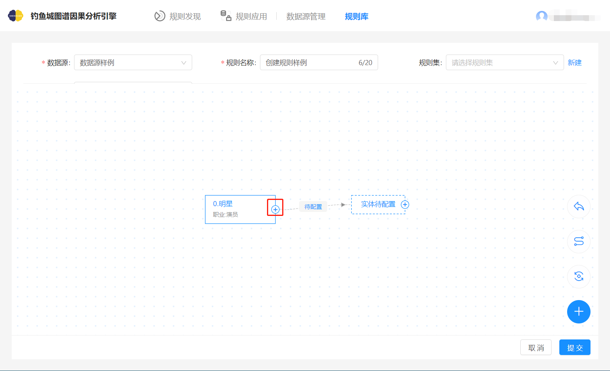

规则库-规则创建-添加实体

 

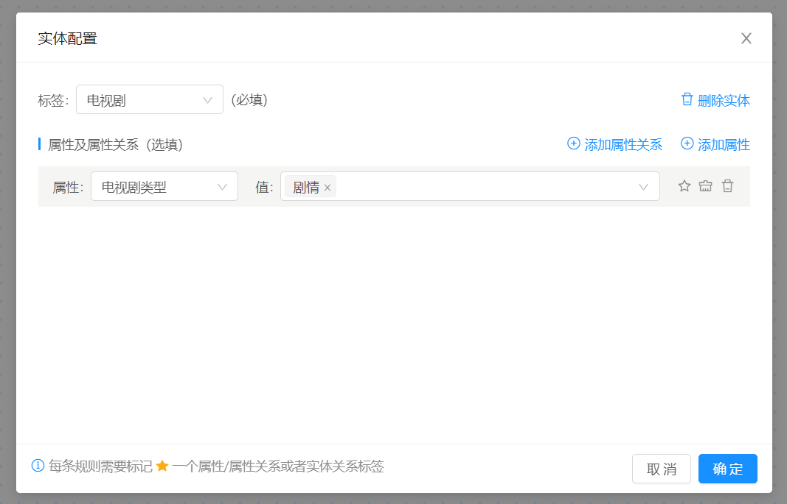

规则库-规则创建-相连实体配置

> 注：
>
> - 上图中，操作可添加实体，操作可自动布局，操作可连接两实体，需注意的是，进入连线模式不可配置实体/实体关系，操作可撤销上一步执行动作。
>
> - 已选定一个实体标签后，系统会自动筛选出能与之产生关联的实体标签供用户选择。

#### **实体关系配置**

1.点击上图中的`待配置`，配置`明星`与`电视剧`实体关系为`参演`。

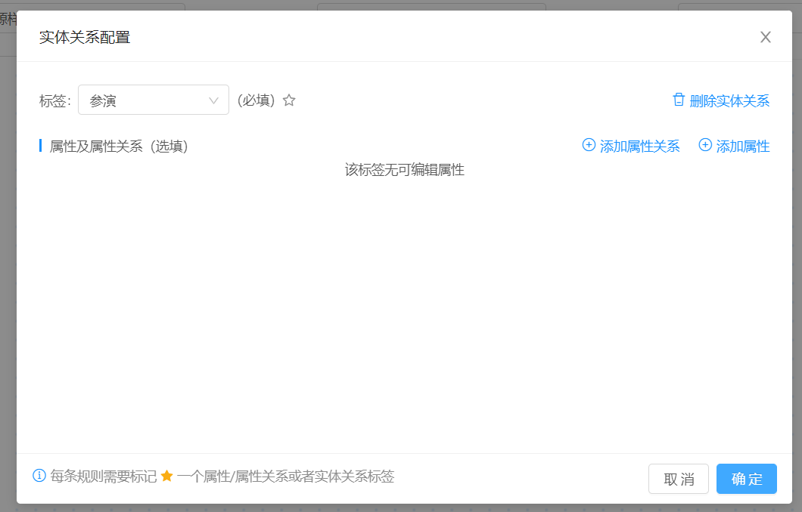

规则库-规则创建-实体关系配置

> 注：
>
> - 两端实体标签已确定时，系统将筛选出与两实体相关联的实体关系标签。

**整体配置**

根据上述实体配置和实体关系配置方式，可完成最终规则配置如下图所示。

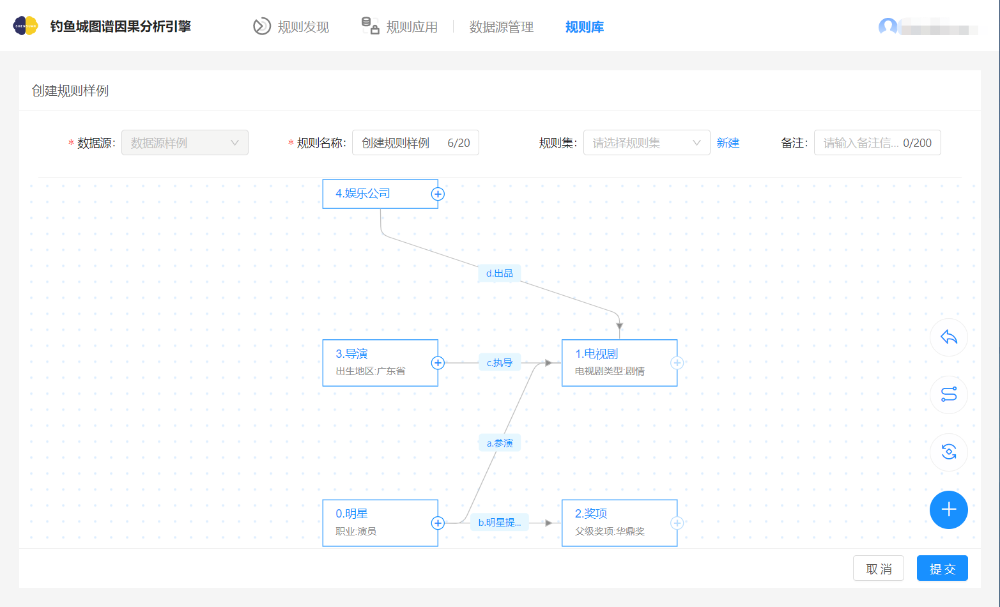

规则库-规则创建-整体配置

#### **标记信息配置**

上图配置中，还需添加标记信息。选择`奖项`实体，并点亮属性旁的星号。

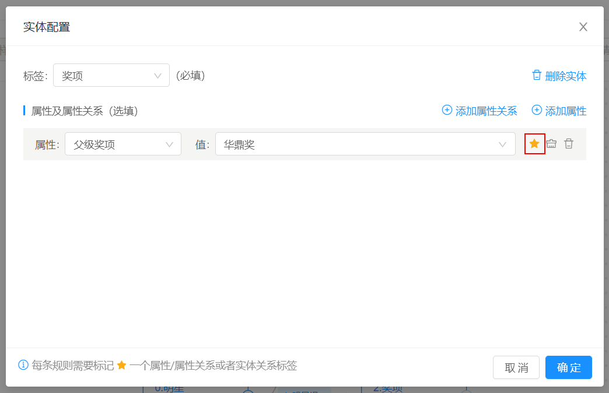

规则库-规则创建-标记信息配置

> 注：
>
> - 标记信息对应于[规则结果查看模块](#图2)图中规则的黄色字体信息。
> - 标记信息在实体关系标签，以及各实体、实体关系属性均可选择，且必须有一处被选为标记信息。若标记的是实体关系的标签，则须满足该实体关系指向的实体编号不是最小的，且该实体不能添加任何属性。

#### **提交配置信息**

点击配置页面中的`提交`，完成人工规则配置，最终规则展示如下图所示。

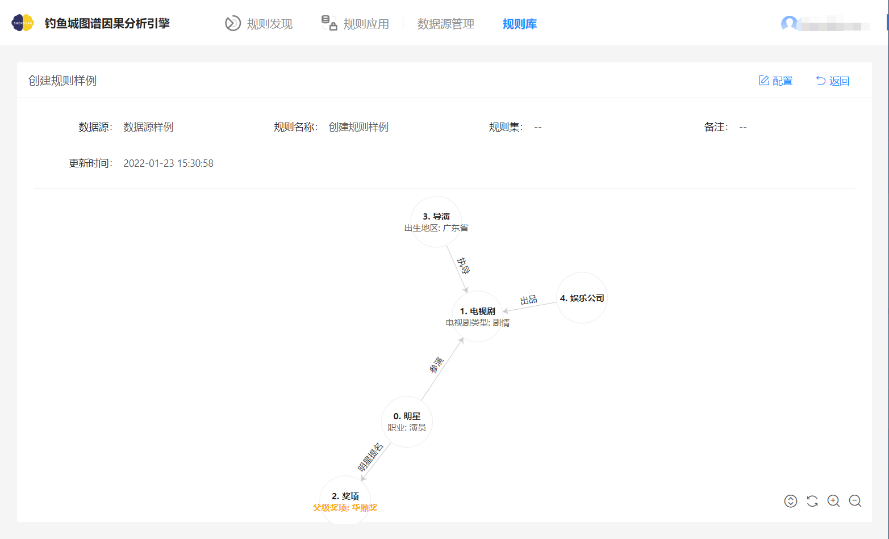

规则库-创建规则查看

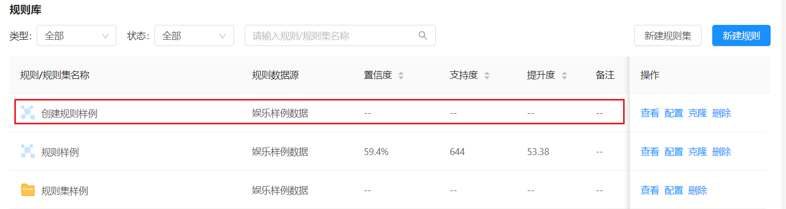

规则库-创建规则所在列表图

> 注：
>
> - 规则解读：如果有一部剧情类电视剧被出生于广东省地区的导演执导，并由娱乐公司出品，且参演它的明星中有一个职业是演员的明星，那么这个明星就有被提名父级奖项：华鼎奖的可能性。

