# 规则发现

该模块提供图数据分析和规则发现服务。用户通过指定数据源、支持度百分比、发现深度以及配置模式结构控制挖掘粒度。系统自动生成规则、计算规则的评价指标、获取实例并提供可视化界面，方便用户查看与操作。

### 前置条件

须满足如下条件：

- 用户已登录。
- `数据源管理`中存在至少一个状态为`已完成`的`数据库数据源/S3数据源`。

 

> [!NOTE]
>
> Use this for infomation messages.

 

### 任务创建

规则发现任务创建具体操作流程如下图所示。

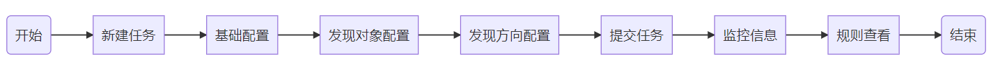

任务创建流程图

以下配置信息，以`数据源样例`为例创建规则发现任务。

 

> [!COMMENT]
>
> Use this for warning messages.

 

#### **新建任务**

 点击`规则发现`，进入规则发现模块，再点击`新建任务`。

 

> **[danger] For danger**
>
> Use this for danger messages.

 

规则发现-新建任务图

#### **基础配置**

按下图输入基础配置信息，完成配置后点击`下一步`

 

> **[success] For success**
>
> Use this for success messages.

 

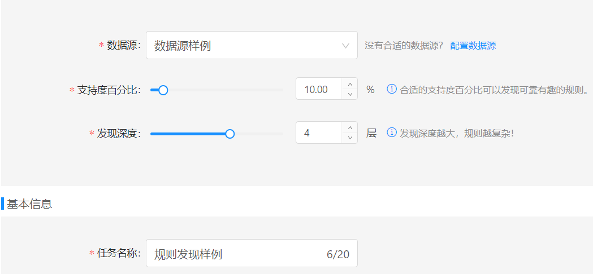

规则发现-基础配置图

**基础配置说明**

|    配置项    |   配置样例   | 配置信息说明                                                 |
| :----------: | :----------: | ------------------------------------------------------------ |
|    数据源    |  数据源样例  | 规则发现任务创建依赖的图数据来源。须在数据源管理模块下`数据库数据源/S3数据源`中，存在状态为`已完成`的数据源。 |
| 支持度百分比 |     10%      | [支持度](#支持度)的比例值，为支持度与全部起始点数量的比值；用于在不同数据集间比较规则的普遍性。参考公式：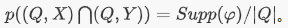注：该参数仅针对发现对象为单实体或者无配置情况生效。 |
|   发现深度   |      4       | 规则的图模式以起始点为中心的最大直径。注：该参数仅针对发现对象为单实体或者无配置情况生效。 |
|   任务名称   | 规则发现样例 | 用户根据需求自定义。                                         |

#### 发现对象配置

1. **添加实体**

  基础配置完成后，进入发现对象设置界面，点击`添加实体`，界面出现`实体待配置`框。

2. **实体配置**

  点击`实体待配置`，标签选择`电视剧`，点击`确定`。

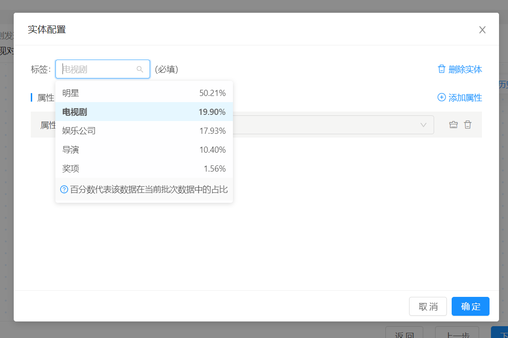

规则发现-实体配置图

**发现对象配置说明**

| 配置项 | 配置样例 | 配置信息说明                                                 |
| :----- | -------- | ------------------------------------------------------------ |
| 标签   | 电视剧   | 标签为用户希望挖掘的规则中实体所含信息，标签为必填项。标签值来源于对应数据源在`数据源管理-数据准备`阶段定义的实体或实体关系的标签名称。 |
| 属性   | 无       | 属性为用户希望挖掘的规则实体/实体关系中所含特性信息，属性为选填项。属性值对应数据源在数据源管理数据准备界面定义的实体或者实体关系下的属性。 |
| 属性值 | 无       | 属性值为实体所含特性的具体描述信息。                         |

> 注：
>
> - 用户配置发现对象可以看作输入信息，通过给定信息，限定发现规则的内容和图模式。
>
> - 属性值既可单选，也可多选，由数据源指定属性类型决定。

**发现对象配置模式说明**

| 发现对象支持模式 | 模式说明                                                     |
| ---------------- | ------------------------------------------------------------ |
| 单实体           | 仅添加单个实体，以该实体作为起始点扩展图模式发现规则。       |
| 连通图           | 添加多个实体，并结合实体关系将实体连接起来，以该连通图发现规则。 |
| 无配置           | 无需进行发现对象配置也可进行规则发现。                       |

> 注：
>
> - 单实体含属性配置：如`规则发现-单实体含属性配置示意图`所示。
> - 连通图配置：发现对象配置中若添加多个实体则实体间必定是能够连接成图的，若存在一个孤立点，则该配置无法提交，如`规则发现-连通图配置示意图`所示。

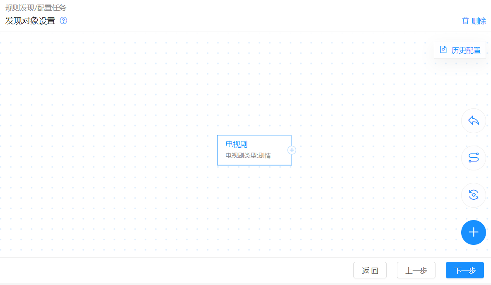

规则发现-单实体含属性配置示意图

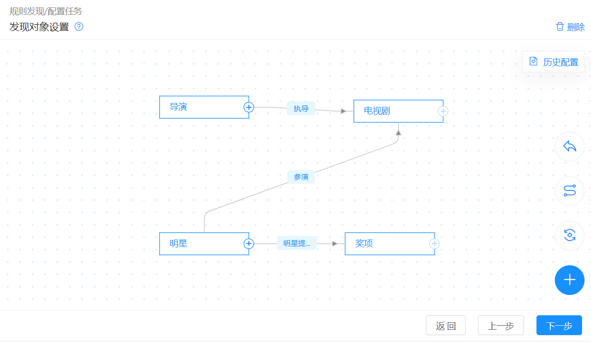

规则发现-连通图配置示意图

#### 发现方向配置

**实体配置及提交任务**

进入发现方向配置界面，不配置任何信息，点击`提交`。

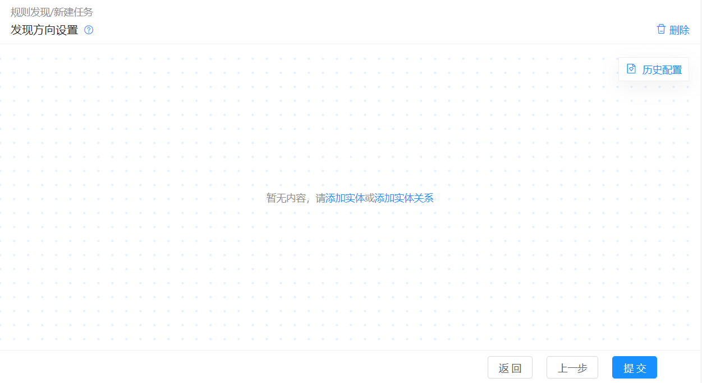

规则发现-发现方向界面图

**发现方向支持模式说明**

| 发现方向支持模式 | 模式说明                                                     |
| ---------------- | ------------------------------------------------------------ |
| 无配置           | 发现方向不配置任何数据，默认图模式中任意实体均可作为发现规则的推导信息。 |
| 单实体无属性     | 挖掘出以该实体下的属性为推导结果的规则。                     |
| 单实体单属性     | 挖掘出以该实体下的指定属性值为推导结果的规则。               |
| 单实体通配属性   | 挖掘出以该实体下指定属性的一个或多个属性值为推导结果的规则。 |
| 连通图无属性     | 仅支持添加两个实体及两者之间的一个实体关系，且均不能含有属性。此配置意为，挖掘以此实体关系为推导结果的规则。 |

> 注：
>
> - 单实体通配属性配置：如`规则发现-单实体含通配属性配置示意图`所示。
>
> - 连通图无属性配置：如`规则发现-连通图无属性配置示意图`所示。

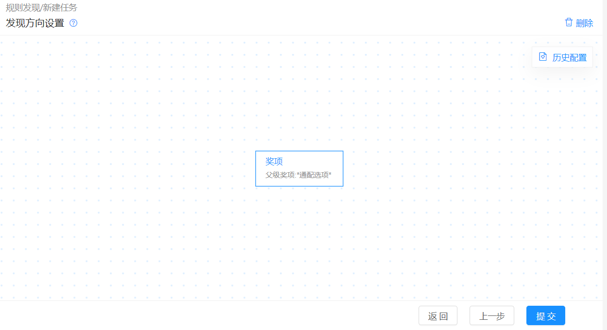

规则发现-单实体含通配属性配置示意图

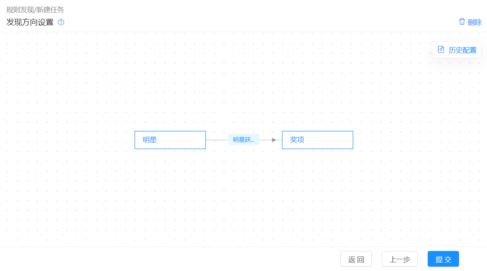

规则发现-连通图无属性配置示意图

#### 监控信息

1. 提交任务后进入监控页面，任务完成5秒后，界面自动跳转到规则发现结果界面。

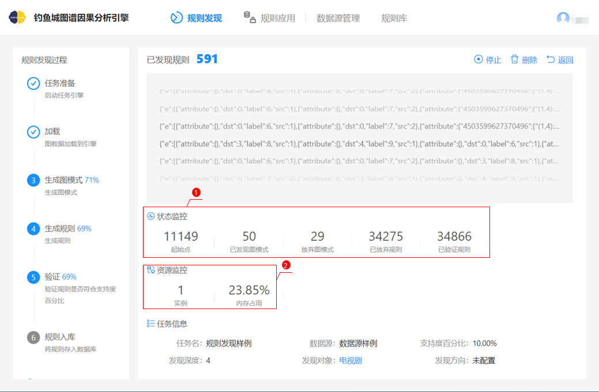

规则发现-监控界面图

**状态监控参数说明**

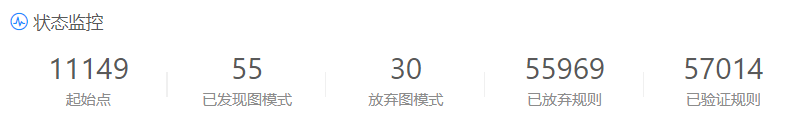

规则发现-监控界面-状态监控指标图

| 信息项       | 信息项说明                                                   |
| ------------ | ------------------------------------------------------------ |
| 起始点       | 展示符合发现对象图模式的起始点数量。                         |
| 已发现图模式 | 若发现对象配置为连通图形式，则已发现图模式数量固定显示为1。若发现对象配置为单实体/无配置形式，则图模式不限定，显示系统发现的图模式数量。 |
| 放弃图模式   | 在发现规则过程中不符合预期的图模式数量。                     |
| 已放弃规则   | 不符合预期或冗余规则数量。                                   |
| 已验证规则   | 根据配置发现的所有规则数量。                                 |

**资源监控参数说明**

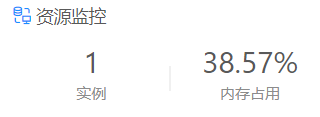

规则发现-资源监控参数说明
 

资源监控

| 信息项   | 信息项说明                     |
| -------- | ------------------------------ |
| 实例     | 运行该规则发现任务的进程数。   |
| 内存占用 | 规则发现任务的动态内存使用率。 |

#### 规则结果查看

1. 任务完成后，界面自动跳转至规则发现结果界面。

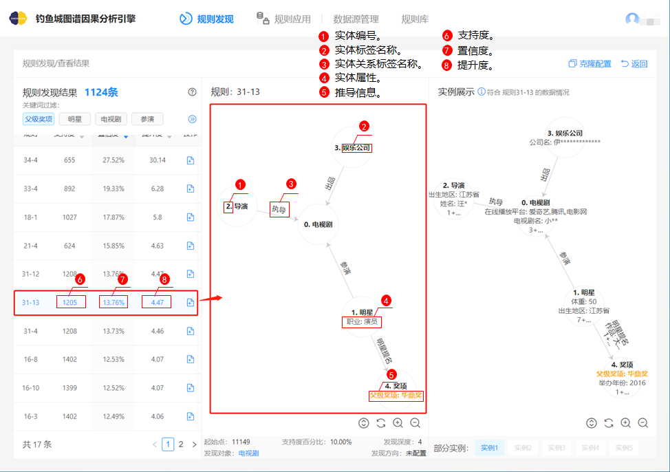

规则发现-规则发现结果图

> 注：
> - 如果有一部电视剧被导演执导，并由一个娱乐公司出品，且参演它的明星中有一个职业是演员的明星，那么这个明星被提名华鼎奖的概率是13.76%（置信度），是正常情况下明星获得华鼎奖概率的4.47倍（提升度），满足这条规则的电视剧在数据源中共有1205部（支持度）。
> - 一般解读规则时，从图中带有0标记的实体开始解读，先解读该实体标签和属性，而后从该实体出发解读其指向或指入的实体标签及属性内容，直至所有实体内容解读完毕，最后再得出推导信息。

**规则参数说明**

1. 参数说明：Q为规则φ的图模式，X和Y为基于Q的属性限制。

    

   | 信息项             | 参考公式                                                     | 信息项说明                                                   |
   | :----------------- | ------------------------------------------------------------ | ------------------------------------------------------------ |
   | 支持度(Support)    | 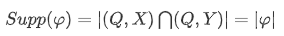 | 当前数据中，同时满足X，Y属性集合及图模式Q的起始点数量（通过起始点去重的实例个数);支持度衡量了该规则在当前数据集中的普遍性。 |
   | 置信度(Confidence) | 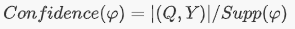 | 置信度代表在当前数据集中，如果一个实例满足图模式Q以及X属性集合，则该实例满足Y属性集合的概率 (P(Y I (Q,X)))。置信度越接近100%，规则越可信。 |
   | 提升度      (Lift) | 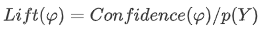 | 提升度代表在当前数据中，图模式Q与属性集合X对Y分布的改变，即该规则的影响力。lift>1时，说明(Q,X)对Y的分布有正向影响(使得Y的出现概率上升)；lift=1说明(Q,X)与Y无关；lift<1说明(Q,X)对Y的分布有负向影响(使得Y的出现概率下降)，规则的lift越远离1则规则越有意义。 |

    

2. 参数说明：Q为规则φ的图模式，X和Y为基于Q的属性限制。

    

   | 信息项             | 参考公式                                                     | 信息项说明                                                   |
   | :----------------- | ------------------------------------------------------------ | ------------------------------------------------------------ |
   | 支持度(Support)    |  | 当前数据中，同时满足X，Y属性集合及图模式Q的起始点数量（通过起始点去重的实例个数);支持度衡量了该规则在当前数据集中的普遍性。 |
   | 置信度(Confidence) |  | 置信度代表在当前数据集中，如果一个实例满足图模式Q以及X属性集合，则该实例满足Y属性集合的概率 (P(Y I (Q,X)))。置信度越接近100%，规则越可信。 |
   | 提升度      (Lift) |  | 提升度代表在当前数据中，图模式Q与属性集合X对Y分布的改变，即该规则的影响力。lift>1时，说明(Q,X)对Y的分布有正向影响(使得Y的出现概率上升)；lift=1说明(Q,X)与Y无关；lift<1说明(Q,X)对Y的分布有负向影响(使得Y的出现概率下降)，规则的lift越远离1则规则越有意义。 |

    

3. 参数说明：Q为规则φ的图模式，X和Y为基于Q的属性限制

    

   

    

4. 参数说明：Q为规则φ的图模式，X和Y为基于Q的属性限制

    

   

3. 参数说明：Q为规则φ的图模式，X和Y为基于Q的属性限制

    
   
   |      |      |      |
   | ---- | ---- | ---- |
   |      |      |      |
   |      |      |      |
   |      |      |      |
   
   

**规则实例查看**

规则实例为某一规则具体举例示意，如下图所示。每个规则对应最多5个实例展示，每个实例与对应规则标签、属性信息一致，且会在此基础上增添更多实际的属性信息，以便用户理解规则含义。 

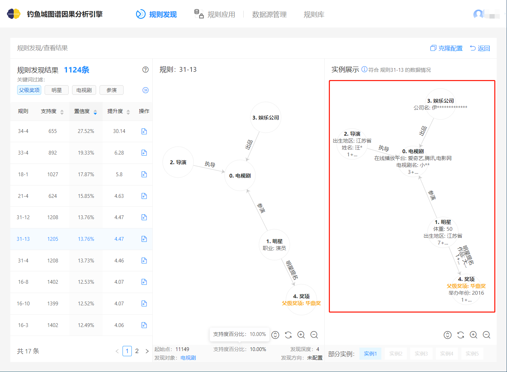

  
规则发现-规则发现结果-实例图

> - 实例详细信息查看：点击图中按键，可显示实例所有内容。

**规则结果页面常用功能说明**

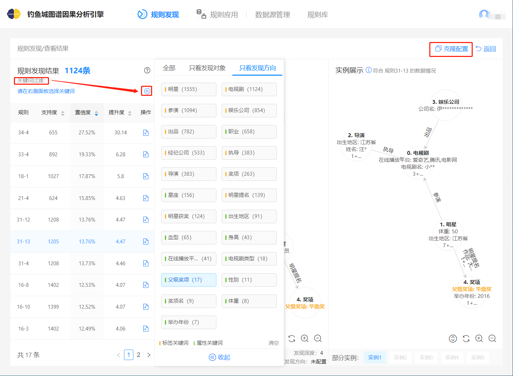

规则发现-规则发现结果-功能示意图

| 功能       | 功能说明                                                     |
| ---------- | ------------------------------------------------------------ |
| 关键词过滤 | 规则发现结果页，根据规则标签、属性，筛选用户所需的规则。     |
| 克隆配置   | 状态为`已结束`的规则发现任务，可通过克隆操作，将创建一个相同配置的任务，任务名称会在原任务名后添加_copy，以示该任务为克隆任务。 |

### 规则入库

 **规则入库操作**

1. 点击`规则发现`，查看“规则发现样例”，进入规则发现结果界面，点击下图所示的入库操作图标。

规则发现-规则入库图

2. 界面弹出弹窗，输入下图所示信息。新建规则集时，需点击规则集旁`确定`，否则规则集不会被创建。

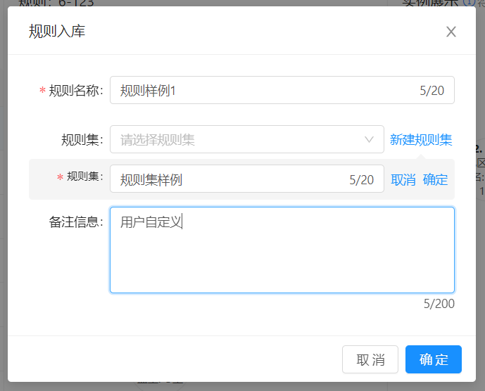

规则发现-规则入库-信息配置图

> 注：
>
> - 可以不新建规则集，若不新建规则集则该规则直接添加至`规则库`中。
>
> - `规则库`内的规则以及规则集命名不能重名。

​      
